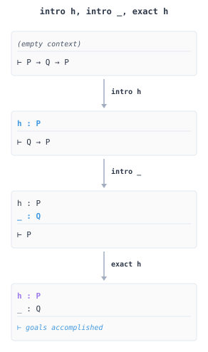
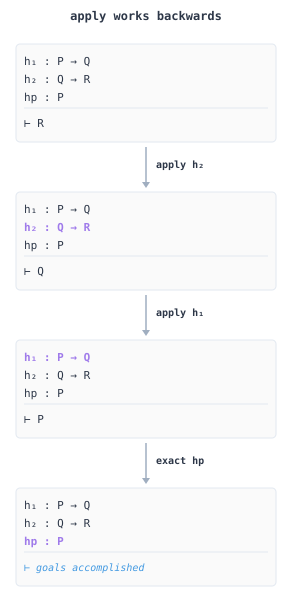

# Proof Strategy

The previous article taught you individual tactics. Now we learn how to think. A proof is not a random sequence of tactics that happens to work. It is a structured argument, and understanding that structure makes the difference between flailing and fluency. The gap between knowing the tactics and knowing how to prove things is the gap between knowing the rules of chess and knowing how to not lose immediately.

## The Goal State

Every proof begins with a goal and ends with no goals. The **goal state** is your map. Learning to read it fluently is the most important skill in tactic-based proving.

```
case succ
n : Nat
ih : P n
⊢ P (n + 1)
```

This goal state tells you everything: you are in the `succ` case of an induction, you have a natural number `n`, you have an **induction hypothesis** `ih` stating that $P(n)$ holds, and you must prove $P(n + 1)$. The **turnstile** $\vdash$ separates what you have from what you need.

When a proof has multiple goals, they appear stacked. The first goal is your current focus. Tactics typically operate on the first goal, though combinators like `all_goals` and `any_goals` can target multiple goals simultaneously.

## Goal State Evolution

Here is an induction proof showing how the goal state evolves at each step:

```lean
{{#include ../../src/ZeroToQED/ProofStrategy.lean:goal_state_example}}
```

The diagram below visualizes how `intro` transforms the goal state step by step. Each box shows the context (hypotheses above the line) and the goal (below the line). Watch how `intro h` moves `P` from the goal into the context:

<figure style="text-align: center; margin: 2em 0;">
  
  <figcaption><em>State evolution for intro h, intro _, exact h: each tactic transforms the goal until none remain.</em></figcaption>
</figure>

## Categories of Tactics

Tactics fall into natural categories based on what they do to the goal state. Understanding these categories helps you choose the right tool.

**Introduction tactics** move structure from the goal into the context. When your goal is $P \to Q$, the tactic `intro h` assumes $P$ (calling it `h`) and changes the goal to $Q$. When your goal is $\forall x, P(x)$, the tactic `intro x` introduces a fresh $x$ and changes the goal to $P(x)$. Introduction tactics make progress by moving the assumptions you are allowed to make into the context, so the goal that remains is smaller.

```lean
{{#include ../../src/ZeroToQED/ProofStrategy.lean:introduction_tactics}}
```

**Elimination tactics** use structure from the context to transform the goal. When you have `h : P ∧ Q` and need $P$, the tactic `exact h.1` extracts the left component. When you have `h : P ∨ Q`, the tactic `cases h` splits into two goals, one assuming $P$ and one assuming $Q$. Elimination tactics make progress by using what you have.

```lean
{{#include ../../src/ZeroToQED/ProofStrategy.lean:elimination_tactics}}
```

**Rewriting tactics** transform the goal using equalities. The tactic `rw [h]` replaces occurrences of the left side of `h` with the right side. The tactic `simp` applies many such rewrites automatically. Rewriting makes progress by simplifying toward something obviously true.

```lean
{{#include ../../src/ZeroToQED/ProofStrategy.lean:rewriting_tactics}}
```

**Automation tactics** search for proofs. The tactic `simp` tries simplification lemmas. The tactic `omega` solves linear arithmetic. The tactic `aesop` performs general proof search. Automation makes progress by doing work you would rather not do by hand.

**Structural tactics** manipulate the proof state without making logical progress. The tactic `swap` reorders goals. The tactic `rename` changes hypothesis names. The tactic `clear` removes unused hypotheses. These tactics keep your proof organized.

## Reading the Goal

Before applying any tactic, ask: what is the shape of my goal? The outermost connective determines your next move.

Goals that require building structure call for introduction tactics. If your goal is an implication $P \to Q$, use `intro` to assume $P$ and reduce the goal to $Q$. Universal statements $\forall x, P(x)$ work the same way: `intro x` gives you an arbitrary $x$ and asks you to prove $P(x)$. For **conjunctions** $P \land Q$, use `constructor` to split into two subgoals. For **disjunctions** $P \lor Q$, you must commit: `left` obligates you to prove $P$, while `right` obligates you to prove $Q$. **Existentials** $\exists x, P(x)$ require a witness: `use t` provides the term $t$ and leaves you to prove $P(t)$.

Goals that are equations or basic facts call for different tactics. For equality $a = b$, try `rfl` if the terms are definitionally equal, `simp` for simplification, `rw` with known equalities, or `ring` for algebraic identities. **Negation** $\neg P$ is secretly an implication: since $\neg P$ means $P \to \bot$, you use `intro h` to assume $P$ and then derive a **contradiction**. If your goal is $\bot$ itself, you need to find conflicting hypotheses.

## Reading the Context

Your context contains hypotheses. Each one is a tool waiting to be used. The shape of a hypothesis determines what you can do with it.

Hypotheses that provide conditional information let you make progress when you can satisfy their conditions. An implication $h : P \to Q$ gives you $Q$ if you can prove $P$. When your goal is $Q$, use `apply h` to reduce it to proving $P$. A universal $h : \forall x, P(x)$ can be instantiated at any term: `specialize h t` replaces $h$ with $P(t)$, or `have ht := h t` keeps the original.

Hypotheses that package multiple facts can be taken apart. A conjunction $h : P \land Q$ gives you both pieces: access them with `h.1` and `h.2`, or destructure with `obtain ⟨hp, hq⟩ := h`. An existential $h : \exists x, P(x)$ packages a witness and a proof: `obtain ⟨x, hx⟩ := h` extracts both. A disjunction $h : P \lor Q$ requires case analysis since you do not know which side holds: `cases h` splits your proof into two branches.

An equality $h : a = b$ lets you substitute. Use `rw [h]` to replace $a$ with $b$ in your goal, or `rw [← h]` to go the other direction.

## Proof Patterns

Certain proof structures recur constantly. Recognizing them saves time.

**Direct proof**: Introduce assumptions, manipulate, conclude. Most proofs follow this pattern.

```lean
{{#include ../../src/ZeroToQED/ProofStrategy.lean:direct_proof}}
```

**Proof by cases**: When you have a disjunction or an inductive type, split and prove each case.

```lean
{{#include ../../src/ZeroToQED/ProofStrategy.lean:proof_by_cases}}
```

**Proof by induction**: For properties of recursive types, prove the base case and the inductive step.

```lean
{{#include ../../src/ZeroToQED/ProofStrategy.lean:proof_by_induction}}
```

**Proof by contradiction**: Assume the negation and derive $\bot$.

```lean
{{#include ../../src/ZeroToQED/ProofStrategy.lean:proof_by_contradiction}}
```

**Proof by contraposition**: To prove $P \to Q$, prove $\neg Q \to \neg P$ instead.

```lean
{{#include ../../src/ZeroToQED/ProofStrategy.lean:proof_by_contraposition}}
```

### Backward and Forward Reasoning

**Backward reasoning** works from goal toward hypotheses. **Forward reasoning** builds from hypotheses toward the goal:

```lean
{{#include ../../src/ZeroToQED/ProofStrategy.lean:backward_reasoning}}
```

The diagram below shows backward reasoning in action. We start with goal `R` and work backwards through the implications. Each `apply` transforms the goal into what we need to establish the premise:

<figure style="text-align: center; margin: 2em 0;">
  
  <figcaption><em>Backward reasoning: apply h₂ changes goal from R to Q, apply h₁ changes Q to P, then exact closes the proof.</em></figcaption>
</figure>

```lean
{{#include ../../src/ZeroToQED/ProofStrategy.lean:forward_reasoning}}
```

### Induction Patterns

Induction is the workhorse for recursive types:

```lean
{{#include ../../src/ZeroToQED/ProofStrategy.lean:induction_patterns}}
```

### Case Splitting

When the path forward depends on which case holds:

```lean
{{#include ../../src/ZeroToQED/ProofStrategy.lean:case_splitting}}
```

### Proof by Contradiction

When direct proof fails, assume the negation and derive absurdity:

```lean
{{#include ../../src/ZeroToQED/ProofStrategy.lean:contradiction}}
```

### Choosing Automation

Different automation tactics excel at different domains:

```lean
{{#include ../../src/ZeroToQED/ProofStrategy.lean:automation_choice}}
```

## When You Get Stuck

Every proof hits obstacles. Here is how to get unstuck.

**Simplify first**. Try `simp` or `simp only [relevant_lemmas]`. Often the goal simplifies to something obvious.

**Check your hypotheses**. Do you have what you need? Use `have` to derive intermediate facts. Use `obtain` to destructure complex hypotheses.

**Try automation**. For arithmetic, try `omega`, `lia`, or `linarith`. For algebraic identities, try `ring` or `field_simp`. For general goals, try `aesop` or `decide`.

**Work backwards**. What would make your goal obviously true? If you need $P \land Q$, you need to prove both $P$ and $Q$. What tactics produce those subgoals?

**Work forwards**. What can you derive from your hypotheses? If you have $h : P \to Q$ and `hp : P`, you can derive $Q$.

**Split the problem**. Use `have` to state and prove intermediate lemmas. Breaking a proof into steps often reveals the path.

**Read the error**. Lean's error messages are verbose but precise. "Type mismatch" tells you what was expected and what you provided. "Unknown identifier" means a name is not in scope. "Unsolved goals" means you are not done.

**Use the library**. Mathlib contains thousands of lemmas. Use `exact?` to search for lemmas that close your goal. Use `apply?` to search for lemmas whose conclusion matches your goal. Use `try?` to throw a whole battery of automation at the goal at once; it reports any script that works as a clickable suggestion. With `set_option autoTry.onEmptyProof true`, Lean runs `try?` for you whenever you leave a `by` block empty.

## Tactic Decision Guide

When staring at a goal, ask: what is its outermost structure? This table maps goal shapes to tactics.

### By Goal Shape

| Goal looks like...             | First tactic to try    | What it does                               |
| ------------------------------ | ---------------------- | ------------------------------------------ |
| `P → Q`                        | `intro h`              | Assume `P`, prove `Q`                      |
| `∀ x, P x`                     | `intro x`              | Introduce arbitrary `x`, prove `P x`       |
| `P ∧ Q`                        | `constructor`          | Split into two goals: prove `P`, prove `Q` |
| `P ∨ Q`                        | `left` or `right`      | Commit to proving one side                 |
| `∃ x, P x`                     | `use t`                | Provide witness `t`, prove `P t`           |
| `¬P` (i.e., `P → False`)       | `intro h`              | Assume `P`, derive contradiction           |
| `a = b` (definitionally equal) | `rfl`                  | Reflexivity closes it                      |
| `a = b` (needs rewriting)      | `simp` or `rw [h]`     | Simplify or rewrite using equalities       |
| `a = b` (algebraic)            | `ring`                 | Solves polynomial identities               |
| `a < b`, `a ≤ b` (linear)      | `omega` or `linarith`  | Decision procedures for linear arithmetic  |
| `True`                         | `trivial`              | Trivially true                             |
| `False`                        | Look for contradiction | Need conflicting hypotheses                |
| Decidable proposition          | `decide`               | Compute the answer                         |
| `a = b` (true by computation)  | `cbv`                  | Evaluate both sides call-by-value          |

### By Hypothesis Shape

| Hypothesis looks like...         | How to use it           | What it does                  |
| -------------------------------- | ----------------------- | ----------------------------- |
| `h : P → Q`                      | `apply h` (goal is `Q`) | Changes goal to `P`           |
| `h : P → Q`                      | `have := h hp`          | Get `Q` if you have `hp : P`  |
| `h : ∀ x, P x`                   | `specialize h t`        | Instantiate at specific `t`   |
| `h : P ∧ Q`                      | `obtain ⟨hp, hq⟩ := h`  | Extract both components       |
| `h : P ∧ Q`                      | `h.1`, `h.2`            | Access components directly    |
| `h : P ∨ Q`                      | `cases h`               | Split into two cases          |
| `h : ∃ x, P x`                   | `obtain ⟨x, hx⟩ := h`   | Extract witness and proof     |
| `h : a = b`                      | `rw [h]`                | Replace `a` with `b` in goal  |
| `h : a = b`                      | `rw [← h]`              | Replace `b` with `a` in goal  |
| `h : False`                      | `contradiction`         | Closes any goal               |
| `h : a ≠ a` or conflicting facts | `contradiction`         | Derives `False` automatically |

### Common Proof Templates

**Implication**: To prove `P → Q`:

```
intro h        -- assume P, call it h
...            -- work toward Q
exact ...      -- provide Q
```

**Universal**: To prove `∀ x, P x`:

```
intro x        -- let x be arbitrary
...            -- prove P x
```

**Conjunction**: To prove `P ∧ Q`:

```
constructor    -- creates two goals
· ...          -- prove P
· ...          -- prove Q
```

**Existential**: To prove `∃ x, P x`:

```
use t          -- provide witness t
...            -- prove P t
```

**Case split**: When you have `h : P ∨ Q`:

```
cases h with
| inl hp => ... -- case where P holds
| inr hq => ... -- case where Q holds
```

**Induction**: To prove `∀ n, P n` by induction:

```
intro n
induction n with
| zero => ...        -- base case: prove P 0
| succ n ih => ...   -- inductive step: ih is P n, prove P (n+1)
```

**Contradiction**: To prove `P` by contradiction:

```
by_contra h    -- assume ¬P
...            -- derive False
```

## Tactic Composition

Tactics compose in several ways. **Sequencing** separates tactics with newlines or semicolons, each operating on the result of the previous one. **Focusing** uses `·` to work on a single goal, with indentation grouping tactics under that focus. **Combinators** like `<;>` apply a tactic to all goals produced by the previous tactic, `first | t1 | t2` tries tactics in order, and `repeat t` applies a tactic until it fails.

```lean
{{#include ../../src/ZeroToQED/ProofStrategy.lean:tactic_composition}}
```

## Proving Termination

The [termination chapter](./08_termination.md) stopped at `termination_by`, the case where naming a measure is enough and Lean finds the proof that it decreases on its own. The remaining cases need a proof from you, and now you have the tools to write one. A termination goal is an ordinary goal: it has hypotheses from the surrounding `if` and `match`, and it asks for an inequality between the measure before and after the recursive call. Everything in this article applies. Read the goal, read the context, and pick the tactic that fits.

### decreasing_by

Sometimes Lean cannot find the proof on its own. The `decreasing_by` clause attaches a tactic block that closes the termination goal manually.

```lean
{{#include ../../src/ZeroToQED/Termination.lean:gcd_decreasing}}
```

The Euclidean GCD recurses on `(b, a % b)`, and the second argument decreases only when `b > 0`. The `if h : b = 0` binding makes the negation `b ≠ 0` available in the `else` branch, and `Nat.pos_of_ne_zero` converts that to `b > 0`. From there, `Nat.mod_lt` finishes the proof. The `_h` underscore prefix tells the linter you know `h` is unused in the `then` branch, since you only need it in `decreasing_by`. Euclid wrote this algorithm down around 300 BC, which makes it older than most everything except dirt, and Lean still wants to see your work.

### Lexicographic Termination

When a function takes multiple arguments and the decreasing one varies between calls, name a tuple as the measure. Lean compares tuples lexicographically. The first component decreases, or it stays equal and the second component decreases.

```lean
{{#include ../../src/ZeroToQED/Termination.lean:lex_termination}}
```

Ackermann is the textbook case, and it is on the textbook for a reason. The function grows faster than every primitive recursive function combined, which is exactly the property that breaks naive termination checkers. The middle clause decreases the first argument from `m + 1` to `m`. The last clause does the same on the outer call, but the inner call `ackermann (m + 1) n` keeps the first argument and decreases the second. The lexicographic order on `(m, n)` covers both. Any drop in `m` wins. If `m` is equal, a drop in `n` suffices. The recursion tree is monstrous, the values are astronomical, and the proof is six tokens.

### Have Clauses

When you can prove the decreasing fact more naturally inline, write a `have` in the body. The compiler scans local hypotheses when synthesizing the termination proof, so a well-named inequality is often all you need.

```lean
{{#include ../../src/ZeroToQED/Termination.lean:have_termination}}
```

This is the same technique [the merge sort example](./07_control_flow.md#structural-recursion) used back in the programming arc. Prove the decrease where you compute it, and the rest happens automatically. Of all the patterns in this section, this is the one to reach for first when something other than a `Nat` is decreasing.

### WellFounded.fix

Every well-founded recursion compiles down to `WellFounded.fix`. The `def` machinery, `termination_by`, `decreasing_by`, and the lexicographic order all desugar to a single application of this fixpoint combinator. Calling it directly is occasionally useful when you want to see what the elaborator is doing, or when you need a one-off recursion outside the usual frame. Mostly it is useful for understanding what was happening behind the curtain the whole time.

```lean
{{#include ../../src/ZeroToQED/Termination.lean:wellfounded_fix}}
```

`WellFounded.fix` takes three things. A proof that some relation is well-founded. A step function that may recurse via the `rec` parameter. An initial argument. The step function must show, for every recursive call, that the new argument is smaller in the well-founded relation. Here that proof is the `have : n - 1 < n` clause, passed explicitly as the second argument to `rec`. Compare this to writing `def countdown` with `termination_by n` and the equivalence becomes clear. The latter is sugar for the former. The sugar is good. The plain version is what the kernel sees.

## Next-Generation Automation

The tactics described so far require you to think. You read the goal, choose a strategy, apply tactics step by step. This is how mathematicians have always worked, and there is value in understanding your proof at every stage. But a new generation of tactics is changing the calculus of what is worth formalizing.

Higher-order tactics like **`aesop`**, **`grind`**, and **SMT integration** lift proof development from low-level term manipulation to structured, automated search over rich proof states. Instead of specifying every proof step, you specify goals, rule sets, or search parameters, and these tactics synthesize proof terms that Lean's kernel then checks. The soundness guarantee does not depend on the automation at all, since the kernel verifies everything, but the human cost drops dramatically. This decoupling of "what should be proved" from "how to construct the term" is what makes large-scale formalization feasible.

[`aesop`](https://github.com/leanprover-community/aesop) implements white-box **best-first proof search**, exploring a tree of proof states guided by user-configurable rules. Unlike black-box automation, `aesop` lets you understand and tune the search: rules are indexed via **discrimination trees** for rapid retrieval, and you can register domain-specific lemmas to teach it new tricks. [`grind`](https://lean-lang.org/doc/reference/latest/The--grind--tactic/) draws inspiration from modern **SMT solvers**, maintaining a shared workspace where **congruence closure**, **E-matching**, and **forward chaining** cooperate on a goal. It excels when many interacting equalities and logical facts are present, automatically deriving consequences that would be tedious to script by hand. Its **E-matching** handles higher-order patterns, so it can instantiate rewrites under binders for functions like `List.foldl`, and an interactive `sym =>` mode lets you drive the same engine one step at a time when you want to watch it work. For goals requiring industrial-strength decision procedures, [SMT tactics](https://github.com/ufmg-smite/lean-smt) send suitable fragments to proof-producing solvers like cvc5, then reconstruct proofs inside Lean so the kernel can verify them. This lets Lean leverage decades of solver engineering while preserving the LCF-style trust model where only the small kernel must be trusted.

Not every goal needs search. Many obligations in verified programs are true purely by **computation**: a list reverses to a known value, a parser consumes a fixed string, a small state machine reaches a final state. For these the `cbv` tactic evaluates both sides call-by-value, the same way the compiler runs the code, and closes the goal without any lemma set. It is the computational counterpart to `grind`'s logical search, and `decide_cbv` extends it to any decidable proposition.

The strategic question is when to reach for automation versus working by hand. The temptation is to try `grind` on everything and move on when it works. This is efficient but opaque: you learn nothing, and when automation fails on a similar goal later, you have no insight into why. A better approach is to use automation to explore, then understand what it found. Goals that would take an hour of tedious case analysis now take seconds. This frees you to tackle harder problems. But remember: when `grind` closes a goal, it has found a valid proof term. It has not gained insight. That remains your job.

## Extending grind

Out of the box `grind` knows the core library: arithmetic, lists, arrays, the usual algebraic laws. It knows nothing about your definitions. To `grind`, a function you just wrote is an uninterpreted symbol, something it can apply congruence to but cannot see inside. The most important skill with `grind` is therefore not calling it but **teaching** it, by registering the lemmas that describe your definitions so that every later proof in the project gets them for free. A project with a well-annotated library finds that most of its routine obligations close with a bare `grind`.

The simplest annotation is an equation. Marking a lemma `@[grind =]` tells `grind` to use its left-hand side as a **pattern**: whenever a term matching `double t` enters the workspace, the E-matching engine instantiates the lemma and adds `double t = 2 * t` to the e-graph. From there arithmetic and congruence do the rest. For a one-off proof you can instead pass the definition directly, `grind [double]`, which unfolds its equations for that call only.

```lean
{{#include ../../src/ZeroToQED/ProofStrategy.lean:grind_extend_eq}}
```

Not every useful fact is an equation. `@[grind →]` marks a **forward** rule, keyed on its hypotheses: as soon as `grind` knows `Positive x`, it derives `x ≠ 0`. `@[grind ←]` marks a **backward** rule, keyed on its conclusion: when the goal (or a subterm grind is trying to establish) matches `Positive (a * b)`, it looks for the premises. The companion `@[grind _=_]` uses both sides of an equation as patterns, and a plain `@[grind]` lets Lean choose. There are also attributes for structural facts: `@[grind cases]` lets `grind` case-split on an inductive predicate, `@[grind ext]` on a structure (or an `@[ext]` lemma) lets `grind` prove equalities field by field, and `@[grind intro]` registers constructors.

```lean
{{#include ../../src/ZeroToQED/ProofStrategy.lean:grind_extend_forward}}
```

Sometimes the automatic pattern is wrong. A lemma like `0 < size xs` has no equation to orient and no hypothesis to key on, so `grind` has nothing to trigger it. The `grind_pattern` command states the trigger explicitly: fire `size_pos` for every `size xs` term. Choosing patterns is the real design work in extending `grind`. Too general a pattern (a bare variable, or a common function like `+`) makes the lemma fire on everything and blows up the search; too specific a pattern means it never fires. A good pattern mentions the new symbol the lemma is about and binds every variable in the statement.

```lean
{{#include ../../src/ZeroToQED/ProofStrategy.lean:grind_extend_pattern}}
```

Once a proof works, `grind?` reports which annotated lemmas it actually used and prints an equivalent `grind only [...]` call, marking each lemma with the role it played (`=` for an equation, `→` for a forward rule, and so on). The `only` form ignores the global annotation set, so it is faster and does not change behavior when someone else adds an annotation elsewhere in the library. It also offers an interactive `grind => instantiate only [...]` script if you want to see the individual steps.

```lean
{{#include ../../src/ZeroToQED/ProofStrategy.lean:grind_extend_only}}
```

The annotation set is also how the rest of the ecosystem plugs in. The `lia` tactic is `grind`'s linear arithmetic engine on its own, and `@[lia]` extends it the same way `@[grind]` extends the full solver. E-matching handles higher-order patterns, so lemmas about `List.map` or `List.foldl` with a function argument can be annotated like any other. `@[grind hom]` marks homomorphism rules such as `(x + y).toNat = (x.toNat + y.toNat) % 2^w`, which translate terms from one domain into another that has a dedicated solver (here, bitvectors into integer arithmetic), and `@[grind hom_pred]` adds the matching range facts. `bv_decide` can be called inside `grind =>` and `sym =>` for bitvector subgoals. When a proof mixes a custom definition, some arithmetic, and a fixed-width word, the pieces cooperate on one e-graph instead of requiring you to split the goal by hand.

A few practical rules. Annotate the lemma that states what a definition _means_, not every intermediate lemma you proved along the way; the annotation set is global, and each extra entry is more work on every call. Prefer `@[grind =]` equations that simplify (the right-hand side should be in terms `grind` already understands). Keep annotations next to the definition they describe, so that importing the definition imports its automation. And when a `grind` call becomes slow, `grind?` followed by `grind only` is usually the fix. The same habit of pinning automation, along with other conventions for keeping a Lean project maintainable, is collected in [Appendix D](./appendix_d_conventions.md).

## The Tactics Reference

The [Tactics Reference](./appendix_c_tactics.md) appendix documents every major tactic in Lean 4 and Mathlib, grouped by what they do. You do not need to memorize it. You need to know it exists, and you need to know how to find the tactic you need.

When you encounter a goal you do not know how to prove, return here. Ask: what is the shape of my goal? What is in my context? What pattern does this proof follow? The answer will point you to the right tactic, and the reference will tell you how to use it.

The strategies in this article apply beyond Lean. The structure of mathematical argument is universal. Direct proof, case analysis, induction, contradiction: these are the fundamental patterns of reason itself. Learning them in a proof assistant merely makes them explicit. You cannot handwave past a case you forgot to consider when the computer is watching.
