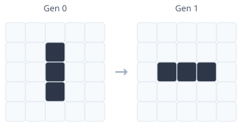
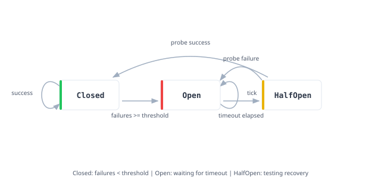

# Software Verification

The promise of theorem provers extends beyond mathematics. We can verify that software does what we claim it does. This article explores several approaches to software verification, building from Lean-only proofs toward techniques that bridge the gap to production code.

## Intrinsically-Typed Interpreters

The standard approach to building interpreters involves two phases. First, parse text into an untyped abstract syntax tree. Second, run a type checker that rejects malformed programs. This works, but the interpreter must still handle the case where a program passes the type checker but evaluates to nonsense. The runtime carries the burden of the type system's failure modes. It is like a bouncer who checks IDs at the door but still has to deal with troublemakers inside.

**Intrinsically-typed interpreters** refuse to play this game. The abstract syntax tree itself encodes typing judgments. An ill-typed program cannot be constructed. The type system statically excludes runtime type errors, not by checking them at runtime, but by making them unrepresentable. The bouncer is replaced by architecture: there is no door for troublemakers to enter.

Consider a small expression language with natural numbers, booleans, arithmetic, and conditionals. We start by defining the types our language supports and a **denotation function** that maps them to Lean types.

```lean
{{#include ../../src/ZeroToQED/Verification.lean:types}}
```

The `denote` function is key. It interprets our object-level types (`Ty`) as meta-level types (`Type`). When our expression language says something has type `nat`, we mean it evaluates to a Lean `Nat`. When it says `bool`, we mean a Lean `Bool`. This type-level interpretation function is what makes the entire approach work.

## Expressions

The expression type indexes over the result type. Each constructor precisely constrains which expressions can be built and what types they produce.

```lean
{{#include ../../src/ZeroToQED/Verification.lean:expr}}
```

Every constructor documents its typing rule. The `add` constructor requires both arguments to be natural number expressions and produces a natural number expression. The `ite` constructor requires a boolean condition and two branches of matching type.

This encoding makes ill-typed expressions unrepresentable. You cannot write `add (nat 1) (bool true)` because the types do not align. The Lean type checker rejects such expressions before they exist.

```lean
{{#include ../../src/ZeroToQED/Verification.lean:impossible}}
```

## Evaluation

The evaluator maps expressions to their denotations. Because expressions are intrinsically typed, the evaluator is total. It never fails, never throws exceptions, never encounters impossible cases. Every pattern match is exhaustive.

```lean
{{#include ../../src/ZeroToQED/Verification.lean:eval}}
```

The return type `t.denote` varies with the expression's type index. A natural number expression evaluates to `Nat`. A boolean expression evaluates to `Bool`. This dependent return type is what makes the evaluator type-safe by construction.

```lean
{{#include ../../src/ZeroToQED/Verification.lean:examples}}
```

## Verified Optimization

Interpreters become interesting when we transform programs. Compilers do this constantly: dead code elimination, loop unrolling, strength reduction. Each transformation promises to preserve meaning while improving performance. But how do we know the promise is kept? A constant folder simplifies expressions by evaluating constant subexpressions at compile time. Adding two literal numbers produces a literal. Conditionals with constant conditions eliminate the untaken branch.

```lean
{{#include ../../src/ZeroToQED/Verification.lean:constfold}}
```

The optimization preserves types. If `e : Expr t`, then `e.constFold : Expr t`. The type indices flow through unchanged. The type system enforces this statically.

But type preservation is a weak property. We want semantic preservation: the optimized program computes the same result as the original. This requires a proof.

```lean
{{#include ../../src/ZeroToQED/Verification.lean:correctness}}
```

The theorem states that for any expression, evaluating the constant-folded expression yields the same result as evaluating the original. The proof proceeds by structural induction on the expression. Most cases follow directly from the induction hypotheses.

## A Verified Compiler

The intrinsically-typed interpreter demonstrates type safety. But real systems compile to lower-level representations. Can we verify the compiler itself? The answer is yes, and it requires remarkably little code. In roughly 40 lines, we can define a source language, a target language, compilation, and prove the compiler correct. This is CompCert in miniature.

The source language is arithmetic expressions: literals, addition, and multiplication. The target language is a stack machine with push, add, and multiply instructions. The compilation strategy is straightforward: literals become pushes, binary operations compile their arguments and then emit the operator.

```lean
{{#include ../../src/ZeroToQED/Compiler.lean:verified_compiler}}
```

The key insight is the `run_append` lemma: executing concatenated instruction sequences is equivalent to executing them in order. This lets us prove correctness compositionally. The main theorem, `compile_correct`, states that running compiled code pushes exactly the evaluated result onto the stack.

The proof proceeds by structural induction on expressions. Literal compilation is trivially correct. For binary operations, we use `run_append` to split the execution: first we run the compiled left argument, then the compiled right argument, then the operator. The induction hypotheses tell us each subexpression evaluates correctly. The operator instruction combines them as expected.

```lean
{{#include ../../src/ZeroToQED/Compiler.lean:compiler_demo}}
```

This is verified compiler technology at its most distilled. The same principles scale to CompCert, which verifies a production C compiler. The gap between 40 lines and 100,000 lines is mostly the complexity of real languages and optimizations, not the verification methodology.

## Proof-Carrying Parsers

The intrinsically-typed interpreter guarantees type safety. The verified compiler guarantees semantic preservation. But what about parsers? A parser takes untrusted input and produces structured data. The traditional approach is to hope the parser is correct and test extensively. The verified approach is to make the parser carry its own proof of correctness.

A **proof-carrying parser** returns both the parsed result and evidence that the result matches the grammar. Invalid parses become type errors rather than runtime errors. The proof is constructed during parsing and verified by the type checker.

We define a grammar as an inductive type with constructors for characters, sequencing, alternation, repetition, and the empty string:

```lean
{{#include ../../src/Examples/ParserCombinators.lean:grammar}}
```

The `Matches` relation defines when a string matches a grammar. Each constructor corresponds to a grammar production: a character matches itself, sequences match concatenations, alternatives match either branch, and repetition matches zero or more occurrences.

A parse result bundles the consumed input, remaining input, and a proof that the consumed portion matches the grammar:

```lean
{{#include ../../src/Examples/ParserCombinators.lean:parser}}
```

The parser combinators construct these proof terms as they parse. When `pchar 'a'` succeeds, it returns a `ParseResult` containing proof that `'a'` matches `Grammar.char 'a'`. When `pseq` combines two parsers, it combines their proofs using the `Matches.seq` constructor:

```lean
{{#include ../../src/Examples/ParserCombinators.lean:combinators}}
```

Soundness is trivial. Every successful parse carries its proof:

```lean
{{#include ../../src/Examples/ParserCombinators.lean:soundness}}
```

The theorem says: if a parser returns a result, then the consumed input matches the grammar. The proof is the identity function, because the evidence is already in the result. Proof-carrying data constructs correctness alongside the computation rather than establishing it after the fact.

## The Stack Machine

We continue with another Lean-only verification example: a stack machine, the fruit fly of computer science. Like the fruit fly in genetics, stack machines are simple enough to study exhaustively yet complex enough to exhibit interesting behavior. The machine has five operations: push a value, pop the top, add the top two values, multiply them, or duplicate the top.

```lean
{{#include ../../src/ZeroToQED/StackMachine.lean:ops}}
```

The `run` function executes a program against a stack:

```lean
{{#include ../../src/ZeroToQED/StackMachine.lean:run}}
```

```lean
{{#include ../../src/ZeroToQED/StackMachine.lean:examples}}
```

### Universal Properties

The power of theorem proving lies not in verifying specific programs but in proving properties about all programs. Consider the composition theorem: running two programs in sequence equals running their concatenation.

```lean
{{#include ../../src/ZeroToQED/StackMachine.lean:composition}}
```

This theorem quantifies over all programs `p1` and `p2` and all initial stacks `s`. The proof proceeds by induction on the first program, with case analysis on each operation and the stack state. The result is a guarantee that holds for the infinite space of all possible programs.

### Stack Effects

Each operation has a predictable effect on stack depth. Push and dup add one element; pop, add, and mul remove one (add and mul consume two and produce one). We can compute the total effect of a program statically:

```lean
{{#include ../../src/ZeroToQED/StackMachine.lean:effect}}
```

The `effect_append` theorem proves that stack effects compose additively. If program `p1` changes the stack depth by `n` and `p2` changes it by `m`, then `p1 ++ p2` changes it by `n + m`. This is another universal property, holding for all programs.

### Program Equivalence

We can also prove that certain program transformations preserve semantics. Addition and multiplication are commutative, so swapping the order of pushes does not change the result:

```lean
{{#include ../../src/ZeroToQED/StackMachine.lean:equivalence}}
```

These theorems justify program transformations. An optimizer that reorders pushes before adds is provably correct. The `dup_add_eq_double` and `dup_mul_eq_square` theorems show that `push n; dup; add` computes `2n` and `push n; dup; mul` computes `n²`. A compiler could use these equivalences for strength reduction.

### What We Proved

The stack machine demonstrates verification of universal properties. We proved that running concatenated programs equals sequential execution (composition), that stack effects compose predictably (effect additivity), that push order does not affect addition or multiplication (commutativity), and that certain instruction sequences compute the same result (equivalences).

These theorems quantify over the entire space of programs, unlike tests of specific inputs. The composition theorem alone covers infinitely many cases that no test suite could enumerate. A passing test establishes an existential claim ("there exists an input where the program works"), while a theorem establishes a universal claim ("for all inputs, the program works"). Tests sample behavior, proofs characterize it completely.

## The Verification Gap

Everything so far lives entirely within Lean. The interpreter is correct by construction. The compiler preserves semantics. The parser carries its proof. The stack machine obeys universal laws. These are real theorems about real programs. And yet they share a fundamental limitation: the verified code and the production code are the same code. There is no gap to bridge because there is no bridge to cross.

Real systems are not written in Lean. They are written in Rust, C, Go, or whatever language the team knows and the platform demands. The gap between a verified model and a production implementation is where bugs hide. A correct specification means nothing if the implementation diverges from it.

To see this gap in concrete terms, consider Conway's Game of Life.

## Conway's Game of Life

Conway's Game of Life is a zero-player game that evolves on an infinite grid. Each cell is either alive or dead. At each step, cells follow simple rules based on the eight neighbors surrounding each cell:

<figure style="text-align: center; margin: 1.5em 0;">
  
  <figcaption><em>Each cell has eight neighbors.</em></figcaption>
</figure>

The rules are simple. A live cell with two or three neighbors survives. A dead cell with exactly three neighbors becomes alive. Everything else dies. From these rules emerges startling complexity: oscillators, spaceships, and patterns that compute arbitrary functions.

The Game of Life is an excellent verification target because we can prove properties about specific patterns without worrying about the infinite grid. The challenge is that the true Game of Life lives on an unbounded plane, which we cannot represent directly. We need a finite approximation that preserves the local dynamics.

The standard solution is a toroidal grid. Imagine taking a rectangular grid and gluing the top edge to the bottom edge, forming a cylinder. Then glue the left edge to the right edge, forming a torus. Geometrically, this is the surface of a donut. A cell at the right edge has its eastern neighbor on the left edge. A cell at the top has its northern neighbor at the bottom. Every cell has exactly eight neighbors, with no special boundary cases.

This topology matters for verification. On a bounded grid with walls, edge cells would have fewer neighbors, changing their evolution rules. We would need separate logic for corners, edges, and interior cells. The toroidal topology eliminates this complexity: the neighbor-counting function is uniform across all cells. More importantly, patterns that fit within the grid and do not interact with their wrapped-around selves behave exactly as they would on the infinite plane. A 5x5 blinker on a 10x10 torus evolves identically to a blinker on the infinite grid, because the pattern never grows large enough to meet itself coming around the other side.

```lean
{{#include ../../src/ZeroToQED/GameOfLife.lean:grid}}
```

The grid representation uses arrays of arrays, with accessor functions that handle boundary conditions. The `countNeighbors` function implements toroidal wrapping by computing indices modulo the grid dimensions.

```lean
{{#include ../../src/ZeroToQED/GameOfLife.lean:neighbors}}
```

The step function applies Conway's rules to every cell. The pattern matching encodes the survival conditions directly: a live cell survives with 2 or 3 neighbors, a dead cell is born with exactly 3 neighbors.

```lean
{{#include ../../src/ZeroToQED/GameOfLife.lean:step}}
```

Now for the fun part. We can define famous patterns and prove properties about them.

The **blinker** is a period-2 oscillator: three cells in a row that flip between horizontal and vertical orientations, then back again.

<figure style="text-align: center; margin: 1.5em 0;">
  
  <figcaption><em>The blinker oscillates between vertical and horizontal orientations.</em></figcaption>
</figure>

The **block** is a 2x2 square that never changes. Each live cell has exactly three neighbors, so all survive. No dead cell has exactly three live neighbors, so none are born.

<figure style="text-align: center; margin: 1.5em 0;">
  
  <figcaption><em>The block is stable: it never changes.</em></figcaption>
</figure>

The **glider** is the star of our show. It is a spaceship: a pattern that translates across the grid. After four generations, the glider has moved one cell diagonally.

<figure style="text-align: center; margin: 1.5em 0;">
  
  <figcaption><em>The glider translates diagonally after four generations.</em></figcaption>
</figure>

After generation 4, the pattern is identical to generation 0, but shifted one cell down and one cell right. The glider crawls across the grid forever.

```lean
{{#include ../../src/ZeroToQED/GameOfLife.lean:patterns}}
```

Here is where theorem proving earns its keep. We can prove that the blinker oscillates with period 2, that the block is stable, and that the glider translates after exactly four generations.

```lean
{{#include ../../src/ZeroToQED/GameOfLife.lean:proofs}}
```

The `native_decide` tactic does exhaustive computation. Lean evaluates the grid evolution and confirms the equality. The proof covers every cell in the grid across the specified number of generations.

We have formally verified that a glider translates diagonally after four steps. Every cellular automaton enthusiast knows this empirically, having watched countless gliders march across their screens. But we have proven it. The glider must translate. It is not a bug that the pattern moves; it is a theorem. (Readers of Greg Egan's [Permutation City](https://en.wikipedia.org/wiki/Permutation_City) may appreciate that we are now proving theorems about the computational substrate in which his characters would live.)

We can also verify that the blinker conserves population, and observe that the glider does too:

```lean
{{#include ../../src/ZeroToQED/GameOfLife.lean:conservation}}
```

For visualization, we can print the grids:

```lean
{{#include ../../src/ZeroToQED/GameOfLife.lean:display}}
```

### The Gap Made Concrete

Here is the sobering reality. We have a beautiful proof that gliders translate. The Lean model captures Conway's rules precisely. The theorems are watertight. And yet, if someone writes a Game of Life implementation in Rust, our proofs say nothing about it.

The Rust implementation in `examples/game-of-life/` implements the same rules. It has the same step function, the same neighbor counting, the same pattern definitions. Run it and you will see blinkers blink and gliders glide. But the Lean proofs do not transfer automatically. The Rust code might have off-by-one errors in the wrap-around logic. It might use different integer semantics. It might have subtle bugs in edge cases that our finite grid proofs never exercise.

This is the central problem of software verification. Writing proofs about mathematical models is satisfying but insufficient. Real software runs on real hardware with real bugs. The gap matters most where the stakes are highest: matching engines that execute trades, auction mechanisms that allocate resources, systems where a subtle bug can cascade into market-wide failures.

How do we bridge the gap between a verified model and a production implementation?

## Verification-Guided Development

The answer comes from **verification-guided development**. The approach has three components. First, write the production implementation in your target language. Second, transcribe the core logic into Lean as a pure functional program. Third, prove properties about the Lean model; the proofs transfer to the production code because the transcription is exact. This technique was [developed by AWS for their Cedar policy language](https://arxiv.org/abs/2407.01688), and it applies wherever a functional core can be isolated from imperative scaffolding.

The transcription must be faithful. Every control flow decision in the Rust code must have a corresponding decision in the Lean model. Loops become recursion. Mutable state becomes accumulator parameters. Early returns become validity flags. When the transcription is exact, we can claim that the Lean proofs apply to the Rust implementation.

To verify this correspondence, both systems produce **execution traces**. A trace records the state after each operation. If the Rust implementation and the Lean model produce identical traces on all inputs, the proof transfers. For finite input spaces, we can verify this exhaustively. For infinite spaces, we can sometimes prove that bounded testing implies unbounded correctness, as we will see with the circuit breaker's uniformity theorem.

## Bounded Model Checking

Many real systems require state machines with complex transition rules: network protocols, payment processing, order lifecycles, and resilience patterns. How do we connect a verified Lean model to a production Rust implementation with strong guarantees?

The **circuit breaker** pattern prevents cascading failures in distributed systems. When a service starts failing, the circuit breaker "trips open" to block requests, giving the service time to recover. After a timeout, it allows a test request through. If the test succeeds, the circuit closes and normal operation resumes. If the test fails, the circuit stays open.

<figure style="text-align: center; margin: 1.5em 0;">
  
  <figcaption><em>The circuit breaker state machine with three states and guarded transitions.</em></figcaption>
</figure>

The key insight is that each state carries different data. A closed breaker tracks failure count. An open breaker tracks when it opened (for timeout calculation). A half-open breaker needs no extra data.

```lean
{{#include ../../src/ZeroToQED/CircuitBreaker.lean:config}}
```

```lean
{{#include ../../src/ZeroToQED/CircuitBreaker.lean:state}}
```

Events trigger transitions between states:

```lean
{{#include ../../src/ZeroToQED/CircuitBreaker.lean:event}}
```

## The Step Function

The entire verification approach centers on one function: `step`. This single function defines all circuit breaker behavior. Both Lean proofs and Rust verification target this exact definition.

```lean
{{#include ../../src/ZeroToQED/CircuitBreaker.lean:step}}
```

This is the source of truth. Every property we prove, every test we run, every guarantee we claim flows from this definition. The function is pure, total, and deterministic.

## Proving Invariants

The state invariant says that closed circuits never accumulate failures beyond the threshold. Once failures reach the threshold, the circuit must trip open.

```lean
{{#include ../../src/ZeroToQED/CircuitBreaker.lean:invariant}}
```

We prove specific transition properties too. Success resets failures. Reaching the threshold trips the circuit. The timeout transitions to half-open. These theorems are definitionally true, following directly from the structure of `step`:

```lean
{{#include ../../src/ZeroToQED/CircuitBreaker.lean:theorems}}
```

## Predicate-Determined State Machines

Before presenting the main theorem, we need to understand why bounded testing can work at all for this system. The answer lies in a structural property: the circuit breaker is **predicate-determined**.

Look carefully at the `step` function. It makes exactly two comparisons: `failures + 1 >= threshold` (should the circuit trip?) and `time - openedAt >= timeout` (has the timeout elapsed?). Everything else is pattern matching on constructors. The function does not compute with the numeric values beyond these two boolean tests. It does not add timeout to threshold. It does not multiply failure counts. It does not branch on whether a timestamp is even or odd. The values flow through the function, but only these two predicates determine the control flow.

Contrast this with a function that lacks this structure:

```
step(count, Increment) = count + 1
```

Here the output depends on the magnitude of `count`, not just on a comparison. Testing with count=0, 1, 2, 3 tells us nothing about count=1000000. The function performs arithmetic that directly affects the output, creating infinitely many distinct behaviors.

The circuit breaker avoids this trap. When it stores `failures + 1` in the new state, that value flows through unchanged until the next comparison. The function never computes `failures * 2` or `threshold - failures`. Values are compared and stored, never combined arithmetically.

This structure has a profound consequence: if two inputs produce the same boolean comparison results, they must produce the same output constructor. With threshold=3 and failures=2, the comparison `failures + 1 >= threshold` yields `true`. With threshold=1000000 and failures=999999, the same comparison also yields `true`. Both inputs take the same branch. Both produce an `Open` state. The actual magnitudes do not matter; only the boolean outcomes do.

## The Uniformity Theorem

The predicate-determined structure enables a remarkable theorem. We formalize the observation above as the **uniformity theorem**. In equational form:

\\[
\text{kind}(s_1) = \text{kind}(s_2) \land \text{kind}(e_1) = \text{kind}(e_2) \land \text{cmp}(s_1, e_1) = \text{cmp}(s_2, e_2)
\\]
\\[
\implies \text{kind}(\text{step}(s_1, e_1)) = \text{kind}(\text{step}(s_2, e_2))
\\]

where \\(\text{kind}\\) extracts the constructor (Closed, Open, or HalfOpen) and \\(\text{cmp}\\) extracts the boolean comparison results. The theorem says: inputs that agree on structure and comparisons produce outputs that agree on structure.

Put simply: the function does not do math with the numbers, it just asks "is this bigger than that?" Once you have tested both "yes" and "no" for each question, you have tested everything.

**Proof sketch**: The proof proceeds in three steps. First, we case-split on the state constructors. If the two states have different constructors (say, one is `Closed` and one is `Open`), the hypothesis `sameStateKind s₁ s₂ = true` is false, giving an immediate contradiction. This eliminates all off-diagonal cases. Second, for each diagonal case (both `Closed`, both `Open`, or both `HalfOpen`), we case-split on event constructors. Again, mismatched events contradict `sameEventKind`. Third, we are left with only the cases where `step` actually branches: `(Closed, Failure)` which checks the threshold, and `(Open, Tick)` which checks the timeout. For these, we case-split on whether each comparison is true or false. The hypothesis `hsame_cmp` says the comparisons have the same boolean result, so if they disagree we have a contradiction. If they agree, both calls to `step` take the same branch and produce outputs with the same constructor.

```lean
{{#include ../../src/ZeroToQED/CircuitBreaker.lean:uniformity}}
```

The theorem states: if two inputs have the same state kind (both `Closed`, both `Open`, or both `HalfOpen`), the same event kind, and the same comparison results, then the outputs have the same state kind. The proof proceeds by exhaustive case analysis on state and event constructors, then shows that matching comparison results force matching output constructors.

### Bounded Verification

The comparison outcomes partition the infinite input space into equivalence classes. All inputs where `failures + 1 >= threshold` is true behave identically (modulo the specific values stored). All inputs where it is false behave identically. Since there are only two comparisons, each boolean, there are at most four equivalence classes per (state kind, event kind) pair.

To verify the implementation for all inputs, we only need to test representatives from each equivalence class. A threshold of 3 with 2 failures represents all cases where the threshold is reached. A threshold of 3 with 0 failures represents all cases where it is not. Testing both covers the infinite space of threshold/failure combinations.

The uniformity theorem provides a mathematical proof that the equivalence classes are complete, eliminating sampling and heuristics. If an implementation passes tests covering all equivalence classes, it is correct for all inputs. Bounded testing with small values that hit both true and false for each comparison proves correctness for all values.

### Where Bounded Model Checking Applies

Many real-world state machines share this predicate-determined structure. _Protocol state machines_ like TCP transition based on flags and sequence number comparisons, not on packet payload arithmetic; a SYN-RECEIVED state becomes ESTABLISHED when ACK is set, regardless of sequence number magnitudes. _Business rule engines_ for order lifecycles (pending, confirmed, shipped, delivered) transition on event types and threshold comparisons like "payment received" or "inventory available," not on order total arithmetic. _Access control systems_ depend on role membership and policy predicates, not on computing with user IDs. _Rate limiters_ using token buckets transition on "tokens available >= cost" comparisons where the exact count matters only for that boolean test.

For any such system, bounded model checking can provide complete verification. The recipe is straightforward: identify all comparisons in the transition function, prove (or convince yourself) that behavior depends only on comparison outcomes, generate test cases covering all combinations of comparison outcomes, and verify the implementation against these cases.

### Where It Does Not Apply

The uniformity property does not hold for systems where output depends on arithmetic over unbounded values. _Counters and accumulators_ that sum transaction amounts cannot be verified by bounded testing; the sum of [1, 2, 3] tells us nothing about [1000000, 2000000]. _Cryptographic functions_ like hashes and encryption depend intimately on bit-level arithmetic where small inputs reveal nothing about large ones. _Numerical algorithms_ involving floating-point, matrix operations, or differential equations have behaviors that depend on magnitude, precision, and numerical stability. _Recursive depth_ matters too: a function that changes behavior at depth 1000 cannot be verified by testing to depth 100. _Overflow-sensitive code_ is particularly treacherous; if the implementation uses fixed-width integers that overflow, the Lean model (using mathematical naturals) diverges at the overflow boundary, and bounded testing might miss the case entirely.

The uniformity theorem gives us a criterion: can you factor the transition function into (1) comparisons that produce booleans, and (2) value shuffling that stores results without arithmetic? If yes, bounded model checking works. If no, you need different techniques.

### The Deeper Principle

The uniformity theorem exemplifies a broader principle in verification: exploit structure to reduce infinite problems to finite ones.

> [!NOTE]
> **The key insight**: The circuit breaker's predicate-determined structure lets us collapse an infinite input space into finitely many equivalence classes. This is non-trivial and depends on the specific structure of this problem. Not all state machines admit such a reduction. The uniformity theorem is a precise statement of _why_ this particular system has this property: because `step` branches only on boolean comparisons, never on arithmetic over values. Systems that compute with their inputs (counters, accumulators, cryptographic functions) do not have this structure and cannot be verified this way.

Other structures enable other reductions:

- **Symmetry**: If a function treats all elements of a set uniformly, test one representative
- **Monotonicity**: If a function is monotonic, test boundary cases
- **Compositionality**: If a function composes smaller functions, verify the pieces

The art of verification is recognizing which structures your system has and exploiting them appropriately. For predicate-determined state machines, bounded model checking provides complete verification, justified by mathematical proof.

## Test Generation

The uniformity theorem justifies generating exhaustive test cases within bounds. We enumerate all states, events, and configurations:

```lean
{{#include ../../src/ZeroToQED/CircuitBreaker.lean:bounds}}
```

```lean
{{#include ../../src/ZeroToQED/CircuitBreaker.lean:testcase}}
```

This generates

\\[
\sum_{t=1}^{4} 10 \times (t + 22) \times 85 = 83{,}300
\\]

test cases: for each threshold \\(t\\), we have 10 timeouts, \\(t + 22\\) states (\\(t\\) closed states plus 21 open states plus half-open), and 85 events. Each test case records the expected output state computed by Lean's `step` function. These cases are exported to JSON for Rust consumption.

## The Rust Implementation

The Rust `step` function must exactly match Lean's semantics. This is the verified core:

```rust
{{#include ../../examples/circuit-breaker/src/lib.rs:step}}
```

Note the use of `saturating_sub` for the timeout check. Lean's natural number subtraction is saturating (returns 0 for negative results), so Rust must use the same semantics to match.

## The Typestate API

The Rust typestate pattern provides an ergonomic API with compile-time state transition safety. The key insight is that every method calls the verified `step` function internally:

```rust
{{#include ../../examples/circuit-breaker/src/lib.rs:record_failure}}
```

Invalid transitions are compile errors. You cannot call `record_failure` on a `CircuitBreaker<Open>`. You cannot call `check_timeout` on a `CircuitBreaker<Closed>`. The type system enforces the state machine protocol at compile time.

## Exhaustive Testing

The Rust test loads all 83,300 test cases and verifies exact correspondence:

```rust
{{#include ../../examples/circuit-breaker/src/lib.rs:exhaustive_test}}
```

The test performs exhaustive verification within bounds, covering every combination of (threshold 1-4, timeout 1-10, state, event). The uniformity theorem guarantees that if all bounded cases pass, the unbounded implementation is correct. The [full Rust source](https://github.com/sdiehl/zero-to-qed/blob/main/examples/circuit-breaker/src/lib.rs) is available on GitHub.

## Where Trust Lives

The verification pipeline has three stages, and each introduces its own risks. Understanding where trust lies is essential to assessing the strength of the overall guarantee.

### Model and Transcription Risk

The Lean model must faithfully capture the intent of the Rust implementation. Unlike systems like CompCert or Coq's extraction mechanism, there is no automatic verified extraction from Lean to Rust. The correspondence relies on manual transcription. If the programmer makes a mistake in the transcription, a correct Lean proof says nothing about the incorrect Rust code.

The typestate API adds another layer. The ergonomic wrapper around the verified `step` function is verified only through unit tests, not exhaustive model checking. A bug in how the wrapper invokes `step` would compromise the guarantee.

### Execution Equivalence Risk

Rust and Lean have different runtime semantics. Rust's `saturating_sub` matches Lean's natural number subtraction, but this correspondence is verified by testing, not by formal proof. A different integer type or subtraction operation could break the equivalence silently.

Integer overflow is particularly treacherous. Lean uses unbounded natural numbers; Rust uses fixed-width integers. If the implementation overflows where the model does not, bounded testing might miss the divergence entirely. The circuit breaker avoids this by keeping all values small, but the risk remains for systems with larger numeric ranges.

### Testing Infrastructure Risk

The verification pipeline includes components that must simply be trusted: the JSON serialization layer that exports test cases from Lean, the serde deserialization that reads them in Rust, and the file I/O that moves data between systems. A bug in any of these components could cause false positives, reporting that tests pass when the implementations actually diverge.

### Defense in Depth

Despite these risks, the approach provides strong guarantees through layered defenses. The Lean model is provably correct: invariant preservation and the uniformity theorem are machine-checked proofs. The Rust `step` function is verified against 83,300 exhaustive test cases. The typestate API prevents invalid transitions at compile time. No single layer is impenetrable, but an attacker (or a bug) would need to defeat multiple independent mechanisms to produce an incorrect result.

The conjunction of all guarantees is captured in a single metatheorem:

```lean
{{#include ../../src/ZeroToQED/CircuitBreaker.lean:correctness}}
```

This theorem is the "golden assertion" of the circuit breaker: the initial state is valid, every transition preserves validity, and behavior depends only on comparison outcomes. If this theorem compiles, the model is correct.

## Closing Thoughts

Why do we prove properties rather than test for them? Rice's [Classes of Recursively Enumerable Sets and Their Decision Problems](https://www.ams.org/journals/tran/1953-074-02/S0002-9947-1953-0053041-6/) provides the fundamental answer: every non-trivial semantic property of programs is undecidable. You cannot write a program that decides whether other programs halt, are correct, never access null, or satisfy any interesting behavioral property. The proof reduces from the halting problem. Verification escapes this limitation by requiring human-provided proofs that the compiler can check, rather than trying to infer properties automatically.

The examples in this article form a hierarchy of verification strength, from weakest to strongest:

- **Game of Life**: `native_decide` exhaustively checks specific finite patterns (gliders glide, blinkers blink), but the guarantees cover only those patterns and only the Lean model.
- **Proof-carrying parsers**: Soundness by construction within Lean, with evidence built alongside computation, though again confined to the Lean model.
- **Intrinsically-typed interpreter**: Ill-typed programs are unrepresentable, a structural guarantee that eliminates entire classes of bugs but only within Lean's type system.
- **Verified compiler**: Semantic preservation universally over all expressions; compiled code produces the same result as interpretation. A stronger claim that quantifies over infinite inputs but remains Lean-only.
- **Stack machine**: Universal theorems (composition, commutativity, effect additivity) quantify over infinite program spaces with no external transfer.
- **Circuit breaker**: The uniformity theorem mathematically justifies that bounded testing covers unbounded inputs, enabling Lean proofs to transfer to a Rust implementation via exhaustive model checking. Only this example bridges the verification gap to production code.

Each example illustrates a different verification technique. The Game of Life and verified compiler use `native_decide` for exhaustive finite computation: Lean evaluates both sides and confirms equality, proof by brute force rather than insight. The stack machine uses structural induction to prove universal properties over infinite program spaces. The circuit breaker combines both: structural induction proves the uniformity theorem, which then justifies exhaustive finite testing as a complete verification technique.

The circuit breaker also demonstrates verification-guided development: we do not verify the Rust code directly. Rust's ownership system, borrow checker, and imperative features make direct verification impractical. Instead, we carve out the functional core, transcribe it to Lean, prove properties there, and transfer the proofs back through exhaustive testing. The verification gap closes through disciplined transcription and bounded model checking justified by mathematical proof.

The techniques scale far beyond toy examples. Financial systems are a particularly compelling domain: matching engines, order books, and clearing systems where bugs can trigger flash crashes or expose participants to unbounded losses. Trading systems are state machines at heart, and the state machines that move money tend to be predicate-determined in exactly the way that makes bounded model checking viable. The theorems exist in papers, and the implementations exist in production. Verification-guided development bridges them.
