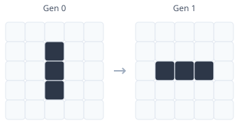
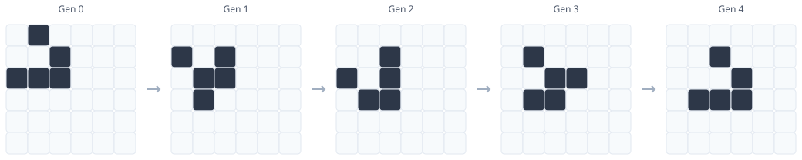
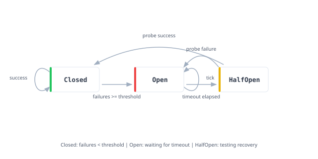

# Model Checking

The [previous article](./21_verified_programs.md) demonstrated verification techniques where everything lives within Lean. But real systems are not written in Lean. They are written in Rust, C, Go, or whatever language the team knows and the platform demands. The gap between a verified model and a production implementation is where bugs hide. A correct specification means nothing if the implementation diverges from it.

This article explores verification-guided development, exhaustive testing within bounds, and the extra arguments needed to turn a finite check into a general guarantee.

## Conway's Game of Life

To see the verification gap in concrete terms, consider Conway's Game of Life. It is a zero-player game that evolves on an infinite grid. Each cell is either alive or dead. At each step, cells follow simple rules based on the eight neighbors surrounding each cell:

<figure style="text-align: center; margin: 1.5em 0;">
  
  <figcaption><em>Each cell has eight neighbors.</em></figcaption>
</figure>

The rules are simple. A live cell with two or three neighbors survives. A dead cell with exactly three neighbors becomes alive. Everything else dies. From these rules emerges startling complexity: oscillators, spaceships, and patterns that compute arbitrary functions.

The Game of Life is an excellent verification target because we can prove properties about specific patterns without worrying about the infinite grid. The challenge is that the true Game of Life lives on an unbounded plane, which we cannot represent directly. We need a finite approximation that preserves the local dynamics.

The standard solution is a toroidal grid. Imagine taking a rectangular grid and gluing the top edge to the bottom edge, forming a cylinder. Then glue the left edge to the right edge, forming a torus. Geometrically, this is the surface of a donut. A cell at the right edge has its eastern neighbor on the left edge. A cell at the top has its northern neighbor at the bottom. Every cell has exactly eight neighbors, with no special boundary cases.

This topology matters for verification. On a bounded grid with walls, edge cells would have fewer neighbors, changing their evolution rules. We would need separate logic for corners, edges, and interior cells. The toroidal topology eliminates this complexity: the neighbor-counting function is uniform across all cells. More importantly, patterns that fit within the grid and do not interact with their wrapped-around selves behave exactly as they would on the infinite plane. A three-cell blinker on a 10x10 torus evolves identically to a blinker on the infinite grid, because the pattern never grows large enough to meet itself coming around the other side.

```lean
{{#include ../../src/ZeroToQED/GameOfLife.lean:grid}}
```

The grid representation uses arrays of arrays, with accessor functions that handle boundary conditions. The `countNeighbors` function implements toroidal wrapping by computing indices modulo the grid dimensions.

```lean
{{#include ../../src/ZeroToQED/GameOfLife.lean:neighbors}}
```

The step function applies Conway's rules to every cell. The pattern matching encodes the survival conditions directly: a live cell survives with 2 or 3 neighbors, a dead cell is born with exactly 3 neighbors.

```lean
{{#include ../../src/ZeroToQED/GameOfLife.lean:step}}
```

Now for the fun part. We can define famous patterns and prove properties about them.

The **blinker** is a period-2 oscillator: three cells in a row that flip between horizontal and vertical orientations, then back again.

<figure style="text-align: center; margin: 1.5em 0;">
  
  <figcaption><em>The blinker oscillates between vertical and horizontal orientations.</em></figcaption>
</figure>

The **block** is a 2x2 square that never changes. Each live cell has exactly three neighbors, so all survive. No dead cell has exactly three live neighbors, so none are born.

<figure style="text-align: center; margin: 1.5em 0;">
  
  <figcaption><em>The block is stable: it never changes.</em></figcaption>
</figure>

The **glider** is the star of our show. It is a spaceship: a pattern that translates across the grid. After four generations, the glider has moved one cell diagonally.

<figure style="text-align: center; margin: 1.5em 0;">
  
  <figcaption><em>The glider translates diagonally after four generations.</em></figcaption>
</figure>

After generation 4, the pattern is identical to generation 0, but shifted one cell down and one cell right. The glider crawls across the grid forever.

```lean
{{#include ../../src/ZeroToQED/GameOfLife.lean:patterns}}
```

Here is where theorem proving earns its keep. We can prove that the blinker oscillates with period 2, that the block is stable, and that the glider translates after exactly four generations.

```lean
{{#include ../../src/ZeroToQED/GameOfLife.lean:proofs}}
```

The `native_decide` tactic does exhaustive computation. Lean evaluates the grid evolution and confirms the equality. The proof covers every cell in the grid across the specified number of generations.

We have formally verified that a glider translates diagonally after four steps. Every cellular automaton enthusiast knows this empirically, having watched countless gliders march across their screens. But we have proven it. The glider must translate. It is not a bug that the pattern moves; it is a theorem. (Readers of Greg Egan's [Permutation City](https://en.wikipedia.org/wiki/Permutation_City) may appreciate that we are now proving theorems about the computational substrate in which his characters would live.)

We can also verify that the blinker conserves population, and observe that the glider does too:

```lean
{{#include ../../src/ZeroToQED/GameOfLife.lean:conservation}}
```

For visualization, we can print the grids:

```lean
{{#include ../../src/ZeroToQED/GameOfLife.lean:display}}
```

### The Gap Made Concrete

Here is the sobering reality. We have a beautiful proof that gliders translate. The Lean model captures Conway's rules precisely. The theorems are watertight. And yet, if someone writes a Game of Life implementation in Rust, our proofs say nothing about it.

The Rust implementation in `examples/game-of-life/` implements the same rules. It has the same step function, the same neighbor counting, the same pattern definitions. Run it and you will see blinkers blink and gliders glide. But the Lean proofs do not transfer automatically. The Rust code might have off-by-one errors in the wrap-around logic. It might use different integer semantics. It might have subtle bugs in edge cases that our finite grid proofs never exercise.

This is the central problem of software verification. Writing proofs about mathematical models is satisfying but insufficient. Real software runs on real hardware with real bugs. The gap matters most where the stakes are highest: matching engines that execute trades, auction mechanisms that allocate resources, systems where a subtle bug can cascade into market-wide failures.

How do we bridge the gap between a verified model and a production implementation?

## Verification-Guided Development

In **verification-guided development**, a production implementation is paired with a formal model of its core logic. We prove properties of the model and use differential testing to look for discrepancies with the implementation. This approach was [developed by AWS for their Cedar policy language](https://arxiv.org/abs/2407.01688). Transferring a theorem requires semantic correspondence: testing supports confidence in that correspondence but does not generally prove it.

Faithful transcription must preserve both control flow and the values computed. Loops may become recursion and mutable state may become accumulator parameters, but numeric representations, error behavior, and runtime assumptions also matter. A proof about the model applies to the implementation only where this correspondence holds.

Both systems can produce **execution traces**, recording state after each operation. Comparing traces detects disagreements on the tested inputs. A finite abstraction can sometimes support an unbounded theorem, but its completeness and its connection to the implementation must themselves be justified. The single-step uniformity theorem below establishes a narrower fact about the Lean model.

## Bounded Model Checking

**Bounded model checking** usually searches executions up to a chosen length for violations of a property, often using SAT or SMT solvers. Absence of a counterexample establishes the bounded claim; a completeness argument is needed to generalize it. Our circuit-breaker example instead enumerates a bounded set of single-step inputs and compares Rust outputs with Lean outputs. This is exhaustive bounded differential testing, not an unbounded verification of Rust.

The **circuit breaker** pattern prevents cascading failures in distributed systems. When a service starts failing, the circuit breaker "trips open" to block requests, giving the service time to recover. After a timeout, it allows a test request through. If the test succeeds, the circuit closes and normal operation resumes. If the test fails, the circuit stays open.

<figure style="text-align: center; margin: 1.5em 0;">
  
  <figcaption><em>The circuit breaker state machine with three states and guarded transitions.</em></figcaption>
</figure>

The key insight is that each state carries different data. A closed breaker tracks failure count. An open breaker tracks when it opened (for timeout calculation). A half-open breaker needs no extra data.

```lean
{{#include ../../src/ZeroToQED/CircuitBreaker.lean:config}}
```

```lean
{{#include ../../src/ZeroToQED/CircuitBreaker.lean:state}}
```

Events trigger transitions between states:

```lean
{{#include ../../src/ZeroToQED/CircuitBreaker.lean:event}}
```

## The Step Function

The model centers on one function, `step`. Lean proofs describe this definition; Rust tests compare a separately written implementation against its outputs.

```lean
{{#include ../../src/ZeroToQED/CircuitBreaker.lean:step}}
```

The Lean function is pure, total, and deterministic. It is the reference for the properties proved here and for the test cases exported to Rust.

## Proving Invariants

The state invariant says that closed circuits never accumulate failures beyond the threshold. Once failures reach the threshold, the circuit must trip open.

```lean
{{#include ../../src/ZeroToQED/CircuitBreaker.lean:invariant}}
```

We prove specific transition properties too. Success resets failures. Reaching the threshold trips the circuit. The timeout transitions to half-open. These theorems are definitionally true, following directly from the structure of `step`:

```lean
{{#include ../../src/ZeroToQED/CircuitBreaker.lean:theorems}}
```

## Predicate-Determined State Machines

The circuit breaker’s next state constructor is determined by the current state constructor, event constructor, and two comparisons: `failures + 1 >= threshold` and `time - openedAt >= timeout`.

This is a statement about control flow. The function also computes and stores values: a failure below the threshold increments the stored count, and opening the circuit stores a timestamp. Equal comparison outcomes therefore need not produce equal states. For example, different counts can both remain `Closed` while carrying different updated counts.

The useful finite classification concerns which branch is taken. The theorem below makes that classification precise for the Lean model.

## The Uniformity Theorem

The predicate-determined structure enables a remarkable theorem. We formalize the observation above as the **uniformity theorem**. In equational form:

\\[
\text{kind}(s_1) = \text{kind}(s_2) \land \text{kind}(e_1) = \text{kind}(e_2) \land \text{cmp}(s_1, e_1) = \text{cmp}(s_2, e_2)
\\]
\\[
\implies \text{kind}(\text{step}(s_1, e_1)) = \text{kind}(\text{step}(s_2, e_2))
\\]

where \\(\text{kind}\\) extracts the constructor (Closed, Open, or HalfOpen) and \\(\text{cmp}\\) extracts the boolean comparison results. The theorem says: inputs that agree on structure and comparisons produce outputs that agree on structure.

The theorem describes the constructor of the next state, not equality of all stored values. It concerns a single step; matching constructor and comparison information now does not assert identical future traces.

**Proof sketch**: The proof proceeds in three steps. First, we case-split on the state constructors. If the two states have different constructors (say, one is `Closed` and one is `Open`), the hypothesis `sameStateKind s₁ s₂ = true` is false, giving an immediate contradiction. This eliminates all off-diagonal cases. Second, for each diagonal case (both `Closed`, both `Open`, or both `HalfOpen`), we case-split on event constructors. Again, mismatched events contradict `sameEventKind`. Third, we are left with only the cases where `step` actually branches: `(Closed, Failure)` which checks the threshold, and `(Open, Tick)` which checks the timeout. For these, we case-split on whether each comparison is true or false. The hypothesis `hsame_cmp` says the comparisons have the same boolean result, so if they disagree we have a contradiction. If they agree, both calls to `step` take the same branch and produce outputs with the same constructor.

```lean
{{#include ../../src/ZeroToQED/CircuitBreaker.lean:uniformity}}
```

The theorem states: if two inputs have the same state kind (both `Closed`, both `Open`, or both `HalfOpen`), the same event kind, and the same comparison results, then the outputs have the same state kind. The proof proceeds by exhaustive case analysis on state and event constructors, then shows that matching comparison results force matching output constructors.

### Bounded Verification

For each state and event constructor pair, the comparison outcomes partition the model’s inputs into finitely many classes. The uniformity theorem proves that each class has a single output constructor. This helps design tests that exercise the model’s branches.

It does not prove that the Rust implementation respects those classes. Even if Rust chooses the same branch, it could compute the wrong stored count or timestamp. A formal transfer argument must establish both the branch decisions and payload computations, including fixed-width arithmetic. Reading the short implementation can support that argument, but does not turn the test suite into a proof.

### Where Finite Abstractions Help

Protocols, access-control rules, and business workflows often admit useful abstractions that forget details irrelevant to a chosen property. To use an abstraction for verification, prove that it preserves the transitions and observations needed by that property. A classification of single-step output constructors alone is not such a proof for arbitrary execution traces.

Arithmetic does not rule out model checking: bit-vector arithmetic is a common target. Nor do comparisons alone make representative testing complete. Bounds, reachability, stored values, and the property being checked determine what can be concluded. Overflow and other boundary behavior deserve explicit analysis beyond small-input tests.

### The Deeper Principle

Structure can reduce a verification problem, but each reduction has its own proof obligation. Symmetry may justify equivalent representatives; compositionality may let verified parts support a larger theorem. Here the proven reduction is limited to the next constructor of the Lean circuit breaker. The Rust tests provide a separate, bounded check of exact values.

## Test Generation

We generate exhaustive test cases within explicit bounds on configurations, timestamps, and invariant-valid states. Closed states have fewer failures than the configured positive threshold; arbitrary raw states are not all included:

```lean
{{#include ../../src/ZeroToQED/CircuitBreaker.lean:bounds}}
```

```lean
{{#include ../../src/ZeroToQED/CircuitBreaker.lean:testcase}}
```

This generates

\\[
\sum_{t=1}^{4} 10 \times (t + 22) \times 85 = 83{,}300
\\]

test cases: for each threshold \\(t\\), we have 10 timeouts, \\(t + 22\\) states (\\(t\\) closed states plus 21 open states plus half-open), and 85 events. Each test case records the expected output state computed by Lean's `step` function. These cases are exported to JSON for Rust consumption.

## The Rust Implementation

The Rust `step` function is intended to match Lean’s semantics on inputs representable by `u64`. This is the implementation tested against the model:

```rust
{{#include ../../examples/circuit-breaker/src/lib.rs:step}}
```

The timeout check uses `saturating_sub` to match natural-number subtraction. The failure count uses `saturating_add(1)`: if this saturates, the result is `u64::MAX`, which reaches every representable threshold, so the branch opens the circuit without storing the saturated count. Otherwise addition is exact. This addresses the overflow boundary even for a directly constructed `State::Closed(u64::MAX)`. It is a source-level argument, not a machine-checked Rust correspondence proof.

## The Typestate API

The Rust typestate API restricts which methods are available in each state. Every transition method delegates to the tested `step` function:

```rust
{{#include ../../examples/circuit-breaker/src/lib.rs:record_failure}}
```

The constructor rejects threshold zero, matching the positive-threshold assumption of the invariant theorem. Transition methods consume the wrapper, preventing reuse of that same value. Invalid method calls are compile errors. You cannot call `record_failure` on a `CircuitBreaker<Open>`. You cannot call `check_timeout` on a `CircuitBreaker<Closed>`. The type system enforces the state machine protocol at compile time.

## Exhaustive Testing

The Rust test loads all 83,300 test cases and verifies exact correspondence:

```rust
{{#include ../../examples/circuit-breaker/src/lib.rs:exhaustive_test}}
```

The test checks exact output equality for the 83,300 generated single-step cases: thresholds 1–4, timeouts 1–10, and the enumerated states and events. Separate tests exercise `u64::MAX` arithmetic boundaries and rejection of a zero threshold. These tests provide evidence of correspondence, not a proof for all inputs. The [full Rust source](https://github.com/sdiehl/zero-to-qed/blob/main/examples/circuit-breaker/src/lib.rs) is available on GitHub.

## Where Trust Lives

The verification pipeline has three stages, and each introduces its own risks. Understanding where trust lies is essential to assessing the strength of the overall guarantee.

### Model and Transcription Risk

The Lean model must faithfully capture the intent of the Rust implementation. Unlike systems like CompCert or Coq's extraction mechanism, there is no automatic verified extraction from Lean to Rust. The correspondence relies on manual transcription. If the programmer makes a mistake in the transcription, a correct Lean proof says nothing about the incorrect Rust code.

The typestate API adds another layer. Its wrapper behavior is tested with unit tests, not formally proved equivalent to the Lean model. A bug in how it invokes `step` can invalidate an intended operational guarantee.

### Execution Equivalence Risk

Rust and Lean have different runtime semantics. Rust's `saturating_sub` matches Lean's natural number subtraction, but this correspondence is verified by testing, not by formal proof. A different integer type or subtraction operation could break the equivalence silently.

Lean’s naturals are unbounded; Rust’s integers are fixed-width. Small test inputs cannot detect every mismatch near the integer boundary. The implementation now handles failure-count addition and timestamp subtraction explicitly, and boundary tests exercise those choices. Positive-threshold wrapper states keep the failure count below the threshold, but the public raw `step` API also accepts states outside that invariant.

### Testing Infrastructure Risk

The verification pipeline includes components that must simply be trusted: the JSON serialization layer that exports test cases from Lean, the serde deserialization that reads them in Rust, and the file I/O that moves data between systems. A bug in any of these components could cause false positives, reporting that tests pass when the implementations actually diverge.

The Lean side has a trust boundary of its own. Proofs by `native_decide` are not replayed by the kernel; the compiled code runs the check and each call adds a generated axiom asserting the result, which `#print axioms` will list. For the Game of Life, that means the compiler and runtime sit in the trusted base alongside the kernel. Where a computation is small enough, `decide` or `decide_cbv` keeps the check inside the kernel instead.

### Defense in Depth

The layers establish different facts. Lean proves invariant preservation and single-step constructor uniformity for the model. Differential tests compare exact Rust outputs with the model on enumerated inputs. Rust’s type system restricts wrapper method calls. A defect can fall outside the coverage of these layers, so their combination should not be described as a proof of Rust correctness.

The following theorem combines the Lean model’s guarantees, under the positive-threshold hypothesis. It does not include the Rust implementation or testing infrastructure:

```lean
{{#include ../../src/ZeroToQED/CircuitBreaker.lean:correctness}}
```

The theorem establishes that the initial state satisfies the invariant, each model transition preserves it, and the next state constructor is uniform under the stated comparisons. These are precise properties of the Lean definition; whether they capture the intended service behavior remains a specification question.

## Closing Thoughts

Why do we prove properties rather than test for them? Rice's [Classes of Recursively Enumerable Sets and Their Decision Problems](https://www.ams.org/journals/tran/1953-074-02/S0002-9947-1953-0053041-6/) provides the fundamental answer: every non-trivial semantic property of programs is undecidable. You cannot write a program that decides whether other programs halt, are correct, never access null, or satisfy any interesting behavioral property. The proof reduces from the halting problem. Verification escapes this limitation by requiring human-provided proofs that the compiler can check, rather than trying to infer properties automatically.

The examples establish different guarantees rather than forming a single ranking:

- **Game of Life**: `native_decide` exhaustively checks specific finite patterns (gliders glide, blinkers blink), but the guarantees cover only those patterns and only the Lean model.
- **Proof-carrying parsers**: Soundness by construction within Lean, with evidence built alongside computation, though again confined to the Lean model.
- **Intrinsically-typed interpreter**: Ill-typed programs are unrepresentable, a structural guarantee that eliminates entire classes of bugs but only within Lean's type system.
- **Verified compiler**: Semantic preservation universally over all expressions; compiled code produces the same result as interpretation. A stronger claim that quantifies over infinite inputs but remains Lean-only.
- **Stack machine**: Universal theorems (composition, commutativity, effect additivity) quantify over infinite program spaces with no external transfer.
- **Circuit breaker**: Universal invariant and constructor-uniformity theorems for the Lean model, plus exhaustive differential tests over a bounded set of Rust inputs. The tests do not prove the implementation correspondence for all inputs.

The Game of Life uses `native_decide` for finite computation, with the corresponding compiler trust. The compiler and stack machine use induction to prove universal properties. The circuit breaker’s uniformity theorem uses case analysis on constructors and comparisons, while its Rust implementation is checked by differential tests.

The circuit breaker demonstrates verification-guided development: isolate a functional core, model it in Lean, prove properties there, and compare the implementation with the model. Direct Rust verification is another option, using dedicated tools. Here the correspondence remains supported by testing and review rather than a formal proof.

The same discipline applies to larger systems: identify the property, state the model assumptions, and keep the implementation correspondence visible. Tests, finite abstractions, and universal proofs are useful together when each claim stays within the evidence supporting it.