# Tactics Reference

[Robin Milner](https://en.wikipedia.org/wiki/Robin_Milner)'s [LCF system](https://en.wikipedia.org/wiki/Logic_for_Computable_Functions) introduced a radical idea in the 1970s: let users extend the theorem prover with custom proof procedures, but channel all proof construction through a small trusted **kernel**. You could write arbitrarily clever automation, and if it produced a proof, that proof was guaranteed valid. **Tactics** are this idea fully realized. They are programs that build proofs, metaprograms that manipulate the **proof state**, search procedures that explore the space of possible arguments. When you write `simp` and Lean simplifies your goal through dozens of rewrite steps, you are invoking a sophisticated algorithm. When you write `omega` and Lean discharges a linear arithmetic obligation, you are running a **decision procedure**. The proof terms these tactics construct may be enormous, but they are checked by the kernel, and the kernel is small enough to trust. Think of tactics as the code you write, and the kernel as the one colleague who actually reads your pull requests.

## Table of Contents

The following covers every user-facing tactic in core Lean 4 and its standard library, plus the Mathlib tactics this book uses. Click on any tactic name to jump to its documentation and examples. Related tactics share an entry.

- [`abel`](#abel) - Prove equalities in abelian groups
- [`ac_nf`](#ac_rfl-and-ac_nf) - Normalize up to associativity and commutativity
- [`ac_rfl`](#ac_rfl-and-ac_nf) - Close equalities up to associativity and commutativity
- [`admit`](#stop-and-admit) - Synonym for sorry
- [`aesop`](#aesop) - General automation tactic
- [`all_goals`](#all_goals) - Apply tactic to all current goals
- [`and_intros`](#and_intros) - Split every nested conjunction
- [`any_goals`](#any_goals) - Apply tactic to any applicable goal
- [`apply`](#apply) - Apply hypotheses or lemmas to solve goals
- [`apply?`](#exact-and-apply) - Search the library for a lemma to apply
- [`apply_assumption`](#solve_by_elim-and-apply_assumption) - Apply one hypothesis
- [`apply_fun`](#apply_fun) - Apply function to both sides of equality
- [`apply_mod_cast`](#exact_mod_cast-and-friends) - apply with casts normalized
- [`apply_rules`](#apply_rules) - Apply a rule set repeatedly
- [`as_aux_lemma`](#as_aux_lemma-and-run_tac) - Store the proof as a separate lemma
- [`assumption`](#assumption) - Use hypothesis matching goal
- [`assumption_mod_cast`](#exact_mod_cast-and-friends) - assumption with casts normalized
- [`bound`](#bound) - Prove inequalities from structure
- [`bv_decide`](#bv_decide) - Decide bit vector goals with a SAT solver
- [`bv_normalize`](#bv_decide) - Bit vector preprocessing only
- [`bv_omega`](#bv_decide) - Bit vector arithmetic via omega
- [`by_cases`](#by_cases) - Perform case splitting
- [`by_contra`](#by_contra) - Proof by contradiction
- [`calc`](#calc) - Chain equations and inequalities
- [`case`](#case-case-next-and-the-focusing-dot) - Select a goal by tag
- [`case'`](#case-case-next-and-the-focusing-dot) - Select a goal by tag without closing it
- [`cases`](#cases) - Case analysis on inductive types
- [`cbv`](#cbv) - Reduce goals by call-by-value evaluation
- [`change`](#show-and-change) - Restate a goal or hypothesis
- [`choose`](#choose) - Extract choice function from forall-exists
- [`classical`](#classical) - Enable classical reasoning in a proof
- [`clear`](#clear) - Remove hypotheses from the context
- [`clear_value`](#clear_value) - Forget the value of a local definition
- [`congr`](#congr) - Prove equality using congruence rules
- [`constructor`](#constructor) - Break down conjunctions, existentials, and iff
- [`contradiction`](#contradiction) - Find contradictions in hypotheses
- [`conv`](#conv) - Targeted rewriting in specific parts
- [`convert`](#convert) - Prove by showing goal equals type of expression
- [`decide`](#decide) - Run decision procedures
- [`decide_cbv`](#native_decide-decide-kernel-and-decide_cbv) - Decide by call-by-value evaluation
- [`decide +kernel`](#native_decide-decide-kernel-and-decide_cbv) - Decide by kernel reduction
- [`decreasing_tactic`](#decreasing_tactic-and-decreasing_trivial) - Default termination proof
- [`decreasing_trivial`](#decreasing_tactic-and-decreasing_trivial) - Extensible termination finisher
- [`decreasing_with`](#decreasing_with) - Termination cleanup, then your tactic
- [`delta`](#unfold-and-delta) - Raw definitional unfolding
- [`done`](#done-and-skip) - Assert no goals remain
- [`dsimp`](#dsimp) - Simplify with definitional rewrites only
- [`eq_refl`](#eq_refl-and-rfl) - exact rfl with fast paths
- [`erw`](#rwa-and-erw) - Rewrite up to definitional unfolding
- [`exact`](#exact) - Provide an exact proof term
- [`exact?`](#exact-and-apply) - Search the library for a closing lemma
- [`exact_mod_cast`](#exact_mod_cast-and-friends) - exact with casts normalized
- [`exfalso`](#exfalso) - Prove anything from False
- [`exists`](#exists) - Provide witnesses, then try trivial
- [`expose_names`](#expose_names) - Make inaccessible names referable
- [`ext`](#ext-extensionality) - Prove equality of functions extensionally
- [`ext1`](#funext-and-ext1) - Apply one extensionality lemma
- [`extract_lets`](#extract_lets-lift_lets-and-let_to_have) - Hoist lets into the context
- [`fail_if_success`](#fail_if_success) - Succeed only if a tactic fails
- [`false_or_by_contra`](#false_or_by_contra) - Change the goal to False
- [`field_simp`](#field_simp) - Simplify field expressions
- [`fin_cases`](#fin_cases) - Split finite type into cases
- [`first`](#first) - Try tactics until one succeeds
- [`focus`](#focus) - Limit tactics to first goal
- [`fun_cases`](#fun_induction-and-fun_cases) - Case split following a function's equations
- [`funext`](#funext-and-ext1) - Equality of functions pointwise
- [`fun_induction`](#fun_induction-and-fun_cases) - Induction following a function's recursion
- [`gcongr`](#gcongr) - Prove inequalities using congruence
- [`generalize`](#generalize) - Replace expressions with variables
- [`get_elem_tactic`](#get_elem_tactic) - Discharge indexing bounds
- [`grind`](#grind) - Proof search using congruence closure
- [`grind_linarith`](#grind_order-and-grind_linarith) - Linear arithmetic via grind
- [`grind_order`](#grind_order-and-grind_linarith) - Order reasoning via grind
- [`grobner`](#grobner) - Polynomial equalities via Gröbner bases
- [`group`](#group) - Prove equalities in groups
- [`guard_expr`](#guard_target-guard_hyp-and-guard_expr) - Assert two expressions are equal
- [`guard_hyp`](#guard_target-guard_hyp-and-guard_expr) - Assert the type of a hypothesis
- [`guard_target`](#guard_target-guard_hyp-and-guard_expr) - Assert the shape of the goal
- [`have`](#have) - Introduce new hypotheses
- [`have'`](#have-havei-and-leti) - have with underscores as goals
- [`haveI`](#have-havei-and-leti) - Inline a fact for instance search
- [`hint`](#hint) - Get tactic suggestions
- [`if`](#if) - Split on a decidable condition
- [`impossible`](#impossible) - Prove that the goal has no proof
- [`induction`](#induction) - Perform inductive proofs
- [`infer_instance`](#infer_instance) - Close a goal by instance resolution
- [`injection`](#injection-and-injections) - Use injectivity of constructors
- [`injections`](#injection-and-injections) - Repeat injection on all hypotheses
- [`interval_cases`](#interval_cases) - Split bounded values into cases
- [`intro`](#intro) - Introduce assumptions from implications and quantifiers
- [`intros`](#intros) - Introduce all binders with inaccessible names
- [`itauto`](#itauto) - Intuitionistic propositional tautologies
- [`iterate`](#iterate-repeat-and-repeat1) - Run a tactic exactly n times
- [`left`](#left-and-right) - Choose left side of disjunction
- [`let`](#let-and-let-rec) - Local definition with visible value
- [`letI`](#have-havei-and-leti) - Inline a definition for instance search
- [`let rec`](#let-and-let-rec) - Local recursive definition
- [`let_to_have`](#extract_lets-lift_lets-and-let_to_have) - Turn lets into haves
- [`lia`](#lia) - Linear integer arithmetic via grind
- [`lift`](#lift) - Lift variable to higher type
- [`lift_lets`](#extract_lets-lift_lets-and-let_to_have) - Float lets outward
- [`linarith`](#linarith) - Prove linear inequalities
- [`linear_combination`](#linear_combination) - Prove from linear combinations
- [`massumption`](#mintro-massumption-and-mexact) - Close with a stateful hypothesis
- [`match`](#match) - Case analysis by pattern matching
- [`mcases`](#mcases-and-mspecialize) - Destructure a stateful hypothesis
- [`mclear`](#mclear-mdup-mrename_i-and-mrevert) - Drop a stateful hypothesis
- [`mconstructor`](#mconstructor-mrefine-mleft-mright-mexists-and-mexfalso) - Split a stateful conjunction
- [`mdup`](#mclear-mdup-mrename_i-and-mrevert) - Duplicate a stateful hypothesis
- [`mexact`](#mintro-massumption-and-mexact) - Close with a stateful term
- [`mexfalso`](#mconstructor-mrefine-mleft-mright-mexists-and-mexfalso) - Stateful proof by contradiction
- [`mexists`](#mconstructor-mrefine-mleft-mright-mexists-and-mexfalso) - Supply a stateful witness
- [`mframe`](#mspec) - Separate pure stateful hypotheses
- [`mhave`](#mhave-and-mreplace) - Add a stateful hypothesis
- [`mintro`](#mintro-massumption-and-mexact) - Introduce stateful hypotheses
- [`mleave`](#mleave-and-mstop) - Leave proof mode and unfold the logic
- [`mleft`](#mconstructor-mrefine-mleft-mright-mexists-and-mexfalso) - Choose the left stateful disjunct
- [`module`](#module) - Prove equalities in modules
- [`mpure`](#mpure-mpure_intro-and-mspecialize_pure) - Move a pure hypothesis out of the stateful context
- [`mpure_intro`](#mpure-mpure_intro-and-mspecialize_pure) - Turn a pure stateful goal into a plain goal
- [`mrefine`](#mconstructor-mrefine-mleft-mright-mexists-and-mexfalso) - Build a stateful goal from a term
- [`mrename_i`](#mclear-mdup-mrename_i-and-mrevert) - Name an inaccessible stateful hypothesis
- [`mreplace`](#mhave-and-mreplace) - Overwrite a stateful hypothesis
- [`mrevert`](#mclear-mdup-mrename_i-and-mrevert) - Move a stateful hypothesis into the goal
- [`mright`](#mconstructor-mrefine-mleft-mright-mexists-and-mexfalso) - Choose the right stateful disjunct
- [`mspec`](#mspec) - Apply a Hoare triple specification
- [`mspecialize`](#mcases-and-mspecialize) - Apply a stateful implication
- [`mspecialize_pure`](#mpure-mpure_intro-and-mspecialize_pure) - Apply a pure lemma to stateful hypotheses
- [`mstart`](#mintro-massumption-and-mexact) - Enter stateful proof mode
- [`mstop`](#mleave-and-mstop) - Leave proof mode, keep the goal
- [`mvcgen`](#mvcgen) - Generate verification conditions
- [`mvcgen_trivial`](#mvcgen) - Discharge trivial verification conditions
- [`native_decide`](#native_decide-decide-kernel-and-decide_cbv) - Decide by compiled evaluation
- [`next`](#case-case-next-and-the-focusing-dot) - Select the next goal
- [`nlinarith`](#nlinarith) - Handle nonlinear inequalities
- [`nofun`](#nofun-and-nomatch) - Prove an implication from an empty type
- [`nomatch`](#nofun-and-nomatch) - Eliminate an empty hypothesis
- [`noncomm_ring`](#noncomm_ring) - Prove in non-commutative rings
- [`norm_cast`](#norm_cast) - Simplify by moving casts outward
- [`norm_num`](#norm_num) - Simplify numerical expressions
- [`nth_rw`](#nth_rw) - Rewrite only the nth occurrence
- [`obtain`](#obtain) - Destructure existentials and structures
- [`omega`](#omega) - Solve linear arithmetic over Nat and Int
- [`open ... in`](#set_option--in-open--in-and-unhygienic) - Scope a namespace to one tactic
- [`pick_goal`](#pick_goal) - Move specific goal to front
- [`positivity`](#positivity) - Prove positivity goals
- [`push_cast`](#push_cast) - Push casts inward
- [`push Not`](#push-not) - Push negations inward
- [`qify`](#qify) - Shift to rationals
- [`rcases`](#rcases) - Case analysis with patterns
- [`refine`](#refine) - Apply with holes to fill later
- [`refine'`](#the-refine-variant) - Refine where every underscore is a goal
- [`rename`](#rename) - Rename hypotheses for clarity
- [`rename_i`](#rename_i) - Name inaccessible hypotheses
- [`repeat`](#repeat) - Apply tactic repeatedly until fails
- [`repeat'`](#iterate-repeat-and-repeat1) - Repeat recursively on all goals
- [`repeat1'`](#iterate-repeat-and-repeat1) - Repeat recursively, at least once
- [`replace`](#replace) - Overwrite a hypothesis with a new one
- [`revert`](#revert) - Move hypotheses back to the goal
- [`rfl`](#rfl-reflexivity) - Prove by reflexivity
- [`rfl'`](#eq_refl-and-rfl) - rfl without smart unfolding
- [`right`](#left-and-right) - Choose right side of disjunction
- [`ring`](#ring) - Prove equalities in commutative rings
- [`rintro`](#rintro) - Introduce and destructure in one step
- [`rotate_left`](#rotate_left-and-rotate_right) - Cycle the goal list
- [`rotate_right`](#rotate_left-and-rotate_right) - Cycle the goal list the other way
- [`run_tac`](#as_aux_lemma-and-run_tac) - Run TacticM code inline
- [`rw`](#rw-rewrite) - Rewrite using equalities
- [`rw?`](#exact-and-apply) - Search the library for a rewrite
- [`rwa`](#rwa-and-erw) - Rewrite, then assumption
- [`rw_mod_cast`](#exact_mod_cast-and-friends) - rw with casts normalized
- [`set_option ... in`](#set_option--in-open--in-and-unhygienic) - Scope an option to one tactic
- [`show`](#show-and-change) - Restate the goal up to definitional equality
- [`show_term`](#show_term) - Report the proof term a tactic built
- [`simp`](#simp) - Apply simplification lemmas
- [`simpa`](#simpa) - Simplify goal and hypothesis, then match
- [`simp_all`](#simp_all) - Simplify everything including hypotheses
- [`simp_rw`](#simp_rw) - Rewrite with simplification at each step
- [`simp_wf`](#simp_wf) - Unfold well-founded relation goals
- [`skip`](#done-and-skip) - Do nothing
- [`smt`](#smt) - Discharge goals to external SMT solvers
- [`solve`](#solve) - First alternative that closes the goal
- [`solve_by_elim`](#solve_by_elim-and-apply_assumption) - Search by applying hypotheses
- [`sorry`](#sorry) - Admit goal without proof
- [`specialize`](#specialize) - Instantiate hypothesis with specific arguments
- [`split`](#split) - Handle if-then-else and pattern matching
- [`split_ifs`](#split_ifs) - Case on if-then-else expressions
- [`stop`](#stop-and-admit) - Sorry the rest of the proof
- [`subst`](#subst) - Substitute variable with its value
- [`subst_eqs`](#subst_vars-and-subst_eqs) - Substitute equations until fixpoint
- [`subst_vars`](#subst_vars-and-subst_eqs) - Substitute every variable equation
- [`suffices`](#suffices) - Reduce the goal to an intermediate claim
- [`swap`](#swap) - Swap first two goals
- [`symm`](#symm) - Swap symmetric relations
- [`symm_saturate`](#symm_saturate) - Add symmetric versions of hypotheses
- [`tauto`](#tauto) - Prove logical tautologies
- [`trace`](#trace-and-trace_state) - Print a message
- [`trace_state`](#trace-and-trace_state) - Print the current goals
- [`trans`](#trans) - Split transitive relations
- [`trivial`](#trivial) - Prove simple goals automatically
- [`try?`](#try-and-autotry) - Search for a proof and suggest the script
- [`try`](#try) - Attempt tactic, continue if fails
- [`unfold`](#unfold-and-delta) - Unfold a definition by its equations
- [`unhygienic`](#set_option--in-open--in-and-unhygienic) - Disable name hygiene for one tactic
- [`use`](#use) - Provide witnesses for existential goals
- [`vcgen`](#mvcgen) - Alternative verification condition generator
- [`with_reducible`](#with_reducible-and-with_unfolding_all) - Run with reducible transparency
- [`with_unfolding_all`](#with_reducible-and-with_unfolding_all) - Run unfolding everything
- [`zify`](#zify) - Shift natural numbers to integers
- [`·`](#case-case-next-and-the-focusing-dot) - Focus on the first goal

## Logical Connectives

### intro

The **`intro`** tactic moves hypotheses from the goal into the local context. When your goal is `∀ x, P x` or `P → Q`, using `intro` names the bound variable or assumption and makes it available for use in the proof.

<figure style="text-align: center; margin: 1.5em 0;">
  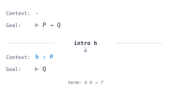
  <figcaption><em>The intro tactic moves hypotheses from the goal into the context.</em></figcaption>
</figure>

```lean
{{#include ../../src/ZeroToQED/Tactics.lean:intro_apply}}
```

### constructor

The `constructor` tactic applies the first constructor of an inductive type to the goal. For `And` (conjunction), it splits the goal into two subgoals. For `Exists`, it expects you to provide a witness. For `Iff`, it creates subgoals for both directions.

<figure style="text-align: center; margin: 1.5em 0;">
  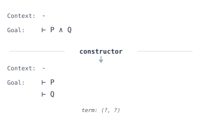
  <figcaption><em>The constructor tactic splits a conjunction goal into two subgoals.</em></figcaption>
</figure>

```lean
{{#include ../../src/ZeroToQED/Tactics.lean:constructor}}
```

### left and right

The `left` and `right` tactics select which side of a disjunction to prove. When your goal is `P ∨ Q`, use `left` to commit to proving `P` or `right` to prove `Q`.

<figure style="text-align: center; margin: 1.5em 0;">
  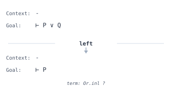
  <figcaption><em>The left tactic commits to proving the left side of a disjunction.</em></figcaption>
</figure>

```lean
{{#include ../../src/ZeroToQED/Tactics.lean:left_right}}
```

### use

The `use` tactic provides a concrete witness for an existential goal. When your goal is `∃ x, P x`, using `use t` substitutes `t` for `x` and leaves you to prove `P t`.

<figure style="text-align: center; margin: 1.5em 0;">
  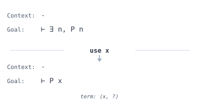
  <figcaption><em>The use tactic provides a witness for an existential goal.</em></figcaption>
</figure>

```lean
{{#include ../../src/ZeroToQED/Tactics.lean:use_existential}}
```

### obtain

The `obtain` tactic extracts components from existential statements and structures in hypotheses. It combines `have` and pattern matching, letting you name both the witness and the proof simultaneously.

<figure style="text-align: center; margin: 1.5em 0;">
  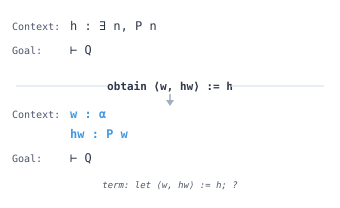
  <figcaption><em>The obtain tactic extracts the witness and proof from an existential hypothesis.</em></figcaption>
</figure>

```lean
{{#include ../../src/ZeroToQED/Tactics.lean:have_obtain}}
```

### intros

The `intros` tactic introduces every leading binder at once with inaccessible names. Since you cannot refer to the names, it pairs with tactics that search the context such as `assumption`, or with `rename_i` to name them afterwards. In finished proofs prefer `intro` with explicit names.

```lean
{{#include ../../src/ZeroToQED/Tactics.lean:intros}}
```

### rintro

The `rintro` tactic combines `intro` with the destructuring patterns of `rcases`. A pattern like `⟨hp, hq⟩` introduces a conjunction and splits it in one step, and `h | h` splits a disjunction into two goals.

```lean
{{#include ../../src/ZeroToQED/Tactics.lean:rintro}}
```

### exists

The `exists` tactic provides witnesses for an existential goal and then runs `trivial` on whatever remains. It is the core Lean counterpart of Mathlib's `use`, and for simple goals the two are interchangeable.

```lean
{{#include ../../src/ZeroToQED/Tactics.lean:exists_tactic}}
```

### `and_intros`

The `and_intros` tactic splits every nested conjunction in the goal into separate subgoals, where `constructor` would split only the outermost one.

```lean
{{#include ../../src/ZeroToQED/Tactics.lean:and_intros}}
```

### nofun and nomatch

The `nofun` tactic proves a goal of the form `P → Q` when `P` is an empty type such as `1 = 2`: the function it builds has no cases at all. The `nomatch h` tactic does the same with a hypothesis already in context, matching on `h` with zero alternatives.

```lean
{{#include ../../src/ZeroToQED/Tactics.lean:nofun_nomatch}}
```

## Applying Lemmas

### exact

The **`exact`** tactic closes a goal by providing a term whose type matches the goal exactly. It performs no additional unification or elaboration beyond what is necessary.

<figure style="text-align: center; margin: 1.5em 0;">
  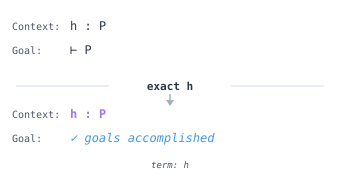
  <figcaption><em>The exact tactic closes the goal by providing a term that matches exactly.</em></figcaption>
</figure>

```lean
{{#include ../../src/ZeroToQED/Tactics.lean:exact_refine}}
```

### apply

The **`apply`** tactic works backwards from the goal. Given a lemma `h : A → B` and a goal `B`, using `apply h` reduces the goal to proving `A`. It unifies the conclusion of the lemma with the current goal.

<figure style="text-align: center; margin: 1.5em 0;">
  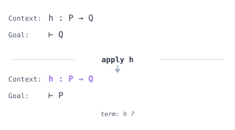
  <figcaption><em>The apply tactic uses a lemma backwards, reducing the goal to its premises.</em></figcaption>
</figure>

### refine

The `refine` tactic is like `exact` but allows placeholders written as `?_` that become new goals. This lets you partially specify a proof term while deferring some parts.

```lean
{{#include ../../src/ZeroToQED/Tactics.lean:exact_refine}}
```

### convert

The `convert` tactic applies a term to the goal even when the types do not match exactly, generating side goals for the mismatches. It is useful when you have a lemma that is almost but not quite what you need.

```lean
{{#include ../../src/ZeroToQED/Tactics.lean:convert}}
```

### specialize

The `specialize` tactic instantiates a universally quantified hypothesis with concrete values, replacing the general statement with a specific instance in your context.

<figure style="text-align: center; margin: 1.5em 0;">
  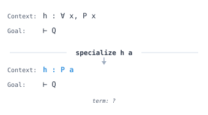
  <figcaption><em>The specialize tactic instantiates a universal hypothesis with a concrete value.</em></figcaption>
</figure>

```lean
{{#include ../../src/ZeroToQED/Tactics.lean:specialize}}
```

### The `refine'` Variant

The `refine'` tactic is `refine` where plain underscores `_` also become new goals instead of holes that must be filled by unification. It is the older behaviour, still useful when you want every missing argument to turn into a goal.

```lean
{{#include ../../src/ZeroToQED/Tactics.lean:refine_prime}}
```

### `apply_rules`

The `apply_rules [r₁, r₂]` tactic applies the listed lemmas and the local hypotheses repeatedly, depth first, until every goal is closed or the depth limit is reached. It is `apply` run as a search.

```lean
{{#include ../../src/ZeroToQED/Tactics.lean:apply_rules}}
```

### `solve_by_elim` and `apply_assumption`

The `solve_by_elim` tactic searches for a proof by repeatedly applying hypotheses from the local context, and `apply_assumption` performs one step of that search. Both are the engine that `exact?` and `apply?` hand over to once a candidate lemma is found.

```lean
{{#include ../../src/ZeroToQED/Tactics.lean:solve_by_elim}}
```

### `infer_instance`

The `infer_instance` tactic closes a goal that is a type class instance by running instance resolution. It is the tactic form of the `inferInstance` term.

```lean
{{#include ../../src/ZeroToQED/Tactics.lean:infer_instance}}
```

## Context Manipulation

### have

The `have` tactic introduces a new hypothesis into the context. You state what you want to prove as an intermediate step, prove it, and then it becomes available for the rest of the proof.

<figure style="text-align: center; margin: 1.5em 0;">
  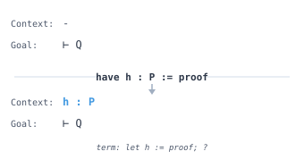
  <figcaption><em>The have tactic introduces an intermediate hypothesis into the context.</em></figcaption>
</figure>

```lean
{{#include ../../src/ZeroToQED/Tactics.lean:have_obtain}}
```

### rename

The `rename` tactic changes the name of a hypothesis in the local context, making proofs more readable when auto-generated names are unclear.

```lean
{{#include ../../src/ZeroToQED/Tactics.lean:rename}}
```

### revert

The `revert` tactic is the inverse of `intro`. It moves a hypothesis from the context back into the goal as an implication or universal quantifier, which is useful before applying induction or certain lemmas.

<figure style="text-align: center; margin: 1.5em 0;">
  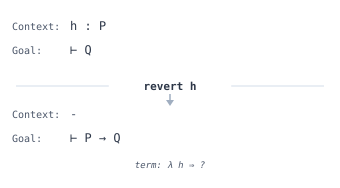
  <figcaption><em>The revert tactic moves a hypothesis back into the goal as an implication.</em></figcaption>
</figure>

```lean
{{#include ../../src/ZeroToQED/Tactics.lean:revert}}
```

### generalize

The `generalize` tactic replaces a specific expression in the goal with a fresh variable, abstracting over that value. This is useful when you need to perform induction on a compound expression.

```lean
{{#include ../../src/ZeroToQED/Tactics.lean:generalize}}
```

### clear

The `clear` tactic removes hypotheses from the context. It fails if anything else still depends on them. Clearing noise before calling automation such as `simp_all` or `grind` can make those tactics both faster and more predictable.

```lean
{{#include ../../src/ZeroToQED/Tactics.lean:clear}}
```

### `clear_value`

The `clear_value x` tactic turns a local definition `x : α := v` into an ordinary hypothesis `x : α`, forgetting the value. Record anything you need about the value first, as the example does with `hx`, or use the form `clear_value (h : x = _)` which adds that equation for you.

```lean
{{#include ../../src/ZeroToQED/Tactics.lean:clear_value}}
```

### `rename_i`

The `rename_i` tactic gives names to inaccessible hypotheses, the ones displayed with a dagger after `intro` without arguments or after `cases`. Names are assigned from the most recent hypothesis backwards.

```lean
{{#include ../../src/ZeroToQED/Tactics.lean:rename_i}}
```

### show and change

The `show t` tactic restates the goal as `t`, which must be definitionally equal to the current goal. It documents the proof and lets you unfold or fold definitions in place. The `change t at h` tactic does the same thing to a hypothesis.

```lean
{{#include ../../src/ZeroToQED/Tactics.lean:show_change}}
```

### suffices

The `suffices h : p from e` tactic is `have` run backwards: it proves the goal from `p` using `e` right away, and leaves `p` itself as the remaining goal. Use it when the reduction is obvious and the interesting work is proving the intermediate statement.

```lean
{{#include ../../src/ZeroToQED/Tactics.lean:suffices}}
```

### replace

The `replace h := e` tactic is `have h := e` followed by clearing the old `h`. It keeps the context tidy when a hypothesis is only ever used to derive a stronger one.

```lean
{{#include ../../src/ZeroToQED/Tactics.lean:replace}}
```

### `have'`, `haveI` and `letI`

The `have'` tactic is `have` built on `refine'`, so underscores in the value become new goals. The `haveI` and `letI` tactics add a fact or definition that is inlined into the proof term rather than bound with a `let`, which matters when the value is a type class instance that later elaboration must see. For propositions, plain `have` does the same job, and Mathlib's linter will say so.

```lean
{{#include ../../src/ZeroToQED/Tactics.lean:have_variants}}
```

### let and `let rec`

The `let x := v` tactic adds a local definition whose value stays visible to the goal, unlike `have`, which forgets it. The `let rec` tactic defines a local recursive function or lemma inside a proof, with the usual termination checking.

```lean
{{#include ../../src/ZeroToQED/Tactics.lean:let_tactic}}
```

### `extract_lets`, `lift_lets` and `let_to_have`

These three tactics manage `let` bindings inside the goal. The `extract_lets` tactic moves them into the local context as definitions, `lift_lets` floats them outward so they can be introduced, and `let_to_have` converts bindings whose values are never used in the type into plain `have`s.

```lean
{{#include ../../src/ZeroToQED/Tactics.lean:lets}}
```

### `expose_names`

The `expose_names` tactic renames every inaccessible hypothesis to a fresh accessible name so a proof script can refer to it. It is what `Try this` suggestions insert when they need to mention such a variable. In hand-written proofs, naming things with `intro` or `rename_i` is clearer.

```lean
{{#include ../../src/ZeroToQED/Tactics.lean:expose_names}}
```

### `subst_vars` and `subst_eqs`

The `subst_vars` tactic runs `subst` on every hypothesis of the form `x = t` or `t = x` where `x` is a local variable. The `subst_eqs` tactic repeatedly substitutes using the equations in the context, replacing left sides by right sides, until nothing changes.

```lean
{{#include ../../src/ZeroToQED/Tactics.lean:subst_vars}}
```

### `symm_saturate`

The `symm_saturate` tactic adds, for every hypothesis `h : a ~ b` whose relation has a `@[symm]` lemma, the flipped version `h_symm : b ~ a`. It is a cheap way to make `assumption` and `simp` succeed without stating the symmetric fact by hand.

```lean
{{#include ../../src/ZeroToQED/Tactics.lean:symm_saturate}}
```

## Rewriting and Simplifying

### rw (rewrite)

The `rw` tactic replaces occurrences of the left-hand side of an equality with the right-hand side. Use `rw [←h]` to rewrite in the reverse direction. Multiple rewrites can be chained in a single `rw [h1, h2, h3]`.

<figure style="text-align: center; margin: 1.5em 0;">
  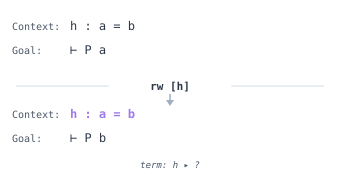
  <figcaption><em>The rw tactic substitutes using an equality hypothesis.</em></figcaption>
</figure>

```lean
{{#include ../../src/ZeroToQED/Tactics.lean:rw_simp}}
```

> [!TIP]
> `rw` uses the first matching occurrence to instantiate the rewrite rule, then rewrites matching occurrences of that instantiated expression; it can rewrite more than one occurrence. Use `rw [h] at hyp` to rewrite in a hypothesis instead of the goal. If rewriting fails due to dependent types or metavariables, try `simp_rw` which handles these cases more gracefully. Use `nth_rw n [h]` to target a specific occurrence.

### simp

The **`simp`** tactic repeatedly applies lemmas marked with `@[simp]` to simplify the goal. It handles common algebraic identities, list operations, and logical simplifications automatically.

```lean
{{#include ../../src/ZeroToQED/Tactics.lean:rw_simp}}
```

> [!TIP]
> Use `simp only [lemma1, lemma2]` for reproducible proofs. Bare `simp` can break when new simp lemmas are added to the library. Use `simp?` to see which lemmas were applied, then replace with `simp only [...]` for stability. In Mathlib code reviews, bare `simp` at non-terminal positions is discouraged.

### `simp_all`

The `simp_all` tactic simplifies both the goal and all hypotheses simultaneously, using each simplified hypothesis to help simplify the others.

```lean
{{#include ../../src/ZeroToQED/Tactics.lean:simp_all}}
```

### `simp_rw`

The `simp_rw` tactic rewrites using the given lemmas but applies simplification at each step, which helps when rewrites would otherwise fail due to associativity or other issues.

```lean
{{#include ../../src/ZeroToQED/Tactics.lean:simp_rw}}
```

### `nth_rw`

The `nth_rw` tactic rewrites only a specific occurrence of a pattern, counting from 1. This gives precise control when an expression appears multiple times and you only want to change one instance.

```lean
{{#include ../../src/ZeroToQED/Tactics.lean:nth_rewrite}}
```

### `norm_num`

The `norm_num` tactic evaluates and simplifies numeric expressions, proving goals like `2 + 2 = 4` or `7 < 10` by computation. It handles arithmetic in various number types.

```lean
{{#include ../../src/ZeroToQED/Tactics.lean:norm_num}}
```

### `norm_cast`

The `norm_cast` tactic normalizes expressions involving type coercions by pushing casts outward and combining them, making goals about mixed numeric types easier to prove.

```lean
{{#include ../../src/ZeroToQED/Tactics.lean:norm_cast}}
```

### `push_cast`

The `push_cast` tactic pushes type coercions inward through operations, distributing a cast over addition, multiplication, and other operations.

```lean
{{#include ../../src/ZeroToQED/Tactics.lean:push_cast}}
```

### conv

The `conv` tactic enters a conversion mode that lets you navigate to specific subexpressions and rewrite only there. It is invaluable when `rw` affects the wrong occurrence or when you need surgical precision.

```lean
{{#include ../../src/ZeroToQED/Tactics.lean:conv}}
```

> [!TIP]
> Navigation commands in `conv` mode: `lhs`/`rhs` select sides of an equation, `arg n` selects the nth argument, `ext` introduces binders, and `enter [1, 2]` navigates by path. Use `conv_lhs` or `conv_rhs` as shortcuts when you only need to work on one side of an equation.

### rwa and erw

The `rwa` tactic is `rw` followed by `assumption`, for the common case where a rewrite turns the goal into one of the hypotheses. The `erw` tactic is `rw` that unfolds definitions while matching the rewrite pattern, so it finds instances that plain `rw` misses at the cost of sometimes rewriting more than you expected.

```lean
{{#include ../../src/ZeroToQED/Tactics.lean:rwa_erw}}
```

### dsimp

The `dsimp` tactic is `simp` restricted to definitional rewrites: beta reduction, unfolding of reducible definitions, and lemmas proved by `rfl`. Because every step is definitional, the result is still definitionally equal to the original goal, which `simp` does not guarantee.

```lean
{{#include ../../src/ZeroToQED/Tactics.lean:dsimp}}
```

### simpa

The `simpa using h` tactic simplifies both the goal and `h` with the same simp set and closes the goal when the two match. Without `using`, it simplifies the goal and finishes with `assumption`.

```lean
{{#include ../../src/ZeroToQED/Tactics.lean:simpa}}
```

### unfold and delta

The `unfold f` tactic replaces `f` by its definition using the equation lemmas Lean generated for it, which handles pattern matching and recursion sensibly. The `delta f` tactic does raw definitional unfolding, exposing the compiled `match` and recursors. Use `unfold`, and reach for `delta` only when `unfold` cannot find an equation to apply.

```lean
{{#include ../../src/ZeroToQED/Tactics.lean:unfold_delta}}
```

### `exact_mod_cast` and friends

The `exact_mod_cast`, `apply_mod_cast`, `rw_mod_cast` and `assumption_mod_cast` tactics are their namesakes with `norm_cast` run first on the goal and on the term or hypothesis involved. They let you use a lemma stated over `Nat` to close a goal stated over `Int`, or the other way around, without writing the cast lemmas yourself.

```lean
{{#include ../../src/ZeroToQED/Tactics.lean:mod_cast}}
```

### `ac_rfl` and `ac_nf`

The `ac_rfl` tactic closes an equality whose two sides are equal up to associativity and commutativity of operators that carry `Std.Associative` and `Std.Commutative` instances. The `ac_nf` tactic normalizes both sides into a canonical form instead of closing the goal, which is useful as a preprocessing step before `rw`.

```lean
{{#include ../../src/ZeroToQED/Tactics.lean:ac_rfl}}
```

## Reasoning with Relations

### rfl (reflexivity)

The `rfl` tactic proves goals of the form `a = a` where both sides are definitionally equal. It works even when the equality is not syntactically obvious but follows from definitions.

<figure style="text-align: center; margin: 1.5em 0;">
  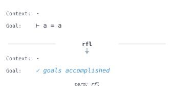
  <figcaption><em>The rfl tactic closes reflexive equality goals.</em></figcaption>
</figure>

```lean
{{#include ../../src/ZeroToQED/Tactics.lean:rfl}}
```

### symm

The `symm` tactic reverses a symmetric relation like equality. If your goal is `a = b` and you have `h : b = a`, using `symm` on `h` or the goal makes them match.

<figure style="text-align: center; margin: 1.5em 0;">
  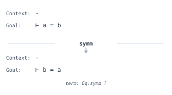
  <figcaption><em>The symm tactic flips the sides of an equality.</em></figcaption>
</figure>

```lean
{{#include ../../src/ZeroToQED/Tactics.lean:symm}}
```

### trans

The `trans` tactic splits a transitive goal like `a = c` into two subgoals `a = b` and `b = c` for a chosen intermediate value `b`. It works for any transitive relation.

<figure style="text-align: center; margin: 1.5em 0;">
  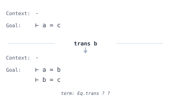
  <figcaption><em>The trans tactic splits an equality into two steps via an intermediate value.</em></figcaption>
</figure>

```lean
{{#include ../../src/ZeroToQED/Tactics.lean:trans}}
```

### subst

The `subst` tactic eliminates a variable by substituting it everywhere with an equal expression. Given `h : x = e`, using `subst h` replaces all occurrences of `x` with `e` and removes `x` from the context.

<figure style="text-align: center; margin: 1.5em 0;">
  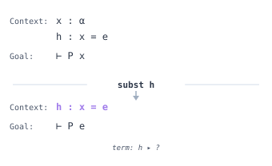
  <figcaption><em>The subst tactic substitutes a variable with its equal value everywhere.</em></figcaption>
</figure>

```lean
{{#include ../../src/ZeroToQED/Tactics.lean:subst}}
```

### ext (extensionality)

The `ext` tactic proves equality of functions, sets, or structures by showing they agree on all inputs or components. It introduces the necessary variables and reduces the goal to pointwise equality.

<figure style="text-align: center; margin: 1.5em 0;">
  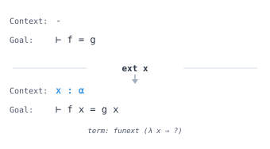
  <figcaption><em>The ext tactic reduces function equality to pointwise equality.</em></figcaption>
</figure>

```lean
{{#include ../../src/ZeroToQED/Tactics.lean:ext}}
```

### calc

The `calc` tactic provides a structured way to write chains of equalities or inequalities. Each step shows the current expression, the relation, and the justification, mirroring traditional mathematical proofs.

```lean
{{#include ../../src/ZeroToQED/Tactics.lean:calc_mode}}
```

### `apply_fun`

The `apply_fun` tactic applies a function to both sides of an equality hypothesis. It automatically generates a side goal requiring the function to be injective when needed.

```lean
{{#include ../../src/ZeroToQED/Tactics.lean:apply_fun}}
```

### congr

The `congr` tactic reduces an equality goal `f a = f b` to proving `a = b`, applying congruence recursively. It handles nested function applications by breaking them into component equalities.

<figure style="text-align: center; margin: 1.5em 0;">
  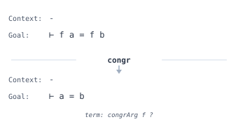
  <figcaption><em>The congr tactic reduces function equality to argument equality.</em></figcaption>
</figure>

```lean
{{#include ../../src/ZeroToQED/Tactics.lean:congr}}
```

### gcongr

The `gcongr` tactic proves inequalities by applying monotonicity lemmas. It automatically finds and applies lemmas showing that operations preserve ordering, such as adding to both sides of an inequality.

```lean
{{#include ../../src/ZeroToQED/Tactics.lean:gcongr}}
```

### `linear_combination`

The `linear_combination` tactic proves an equality by showing it follows from a linear combination of given hypotheses. You specify the coefficients, and it verifies the algebra.

```lean
{{#include ../../src/ZeroToQED/Tactics.lean:linear_combination}}
```

### positivity

The `positivity` tactic proves goals asserting that an expression is positive, nonnegative, or nonzero. It analyzes the structure of the expression and applies appropriate lemmas automatically.

```lean
{{#include ../../src/ZeroToQED/Tactics.lean:positivity}}
```

### bound

The `bound` tactic proves inequality goals by recursively analyzing expression structure and applying bounding lemmas. It is particularly effective for expressions built from well-behaved operations.

```lean
{{#include ../../src/ZeroToQED/Tactics.lean:bound}}
```

### `eq_refl` and `rfl'`

The `eq_refl` tactic is `exact rfl` with a few fast paths, and `rfl'` is `rfl` with smart unfolding switched off, so it will unfold definitions that `rfl` leaves alone. Plain `rfl` is the right default; these are for the rare cases where it stops short.

```lean
{{#include ../../src/ZeroToQED/Tactics.lean:eq_refl}}
```

### funext and ext1

The `funext x` tactic reduces an equality between functions to an equality between their values at an arbitrary `x`. The `ext1` tactic applies exactly one extensionality lemma, where `ext` keeps applying them as far as it can.

```lean
{{#include ../../src/ZeroToQED/Tactics.lean:funext_ext1}}
```

## Reasoning Techniques

### cases

The `cases` tactic performs case analysis on an inductive type, creating separate subgoals for each constructor. For a natural number, it splits into the zero case and the successor case.

<figure style="text-align: center; margin: 1.5em 0;">
  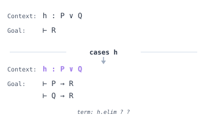
  <figcaption><em>The cases tactic splits on an inductive value, creating one subgoal per constructor.</em></figcaption>
</figure>

```lean
{{#include ../../src/ZeroToQED/Tactics.lean:cases_induction}}
```

### induction

The `induction` tactic sets up a proof by induction on an inductive type. It creates a base case for each non-recursive constructor and an inductive case with an induction hypothesis for each recursive constructor.

<figure style="text-align: center; margin: 1.5em 0;">
  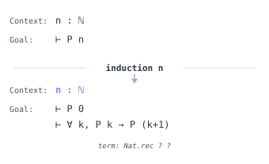
  <figcaption><em>The induction tactic creates base case and inductive step goals.</em></figcaption>
</figure>

```lean
{{#include ../../src/ZeroToQED/Tactics.lean:cases_induction}}
```

> [!TIP]
> Use `induction n with | zero => ... | succ n ih => ...` for structured case syntax. If your induction hypothesis is too weak, try `revert` on additional variables before inducting, or use `induction n generalizing x y` to strengthen the hypothesis. For mutual or nested induction, consider `induction ... using` with a custom recursor.

### split

The `split` tactic splits goals involving `if-then-else` expressions or pattern matching into separate cases. It creates subgoals for each branch with the appropriate condition as a hypothesis.

```lean
{{#include ../../src/ZeroToQED/Tactics.lean:split}}
```

### `split_ifs`

The `split_ifs` tactic finds all `if-then-else` expressions in the goal and splits on their conditions, creating cases for each combination of true and false branches.

```lean
{{#include ../../src/ZeroToQED/Tactics.lean:split_ifs}}
```

### contradiction

The `contradiction` tactic closes the goal by finding contradictory hypotheses in the context, such as `h1 : P` and `h2 : ¬P`, or an assumption of `False`.

<figure style="text-align: center; margin: 1.5em 0;">
  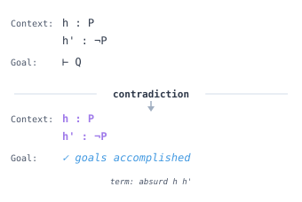
  <figcaption><em>The contradiction tactic finds conflicting hypotheses and closes the goal.</em></figcaption>
</figure>

```lean
{{#include ../../src/ZeroToQED/Tactics.lean:contradiction_exfalso}}
```

### exfalso

The `exfalso` tactic changes any goal to `False`, applying the principle of explosion. Use this when you can derive a contradiction from your hypotheses.

<figure style="text-align: center; margin: 1.5em 0;">
  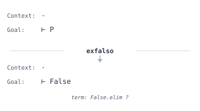
  <figcaption><em>The exfalso tactic changes any goal to False.</em></figcaption>
</figure>

```lean
{{#include ../../src/ZeroToQED/Tactics.lean:contradiction_exfalso}}
```

### `by_contra`

The `by_contra` tactic starts a proof by contradiction. It adds the negation of the goal as a hypothesis and changes the goal to `False`, requiring you to derive a contradiction.

<figure style="text-align: center; margin: 1.5em 0;">
  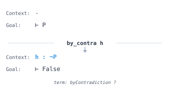
  <figcaption><em>The by_contra tactic assumes the negation and requires deriving False.</em></figcaption>
</figure>

```lean
{{#include ../../src/ZeroToQED/Tactics.lean:by_contra}}
```

**Proof of negation vs proof by contradiction**: These are often confused but differ in an important way. A **proof of negation** proves `¬P` by assuming `P` and deriving `False`. This is constructive since `¬P` is defined as `P → False`. A **proof by contradiction** proves `P` by assuming `¬P` and deriving `False`. This requires classical logic (double negation elimination) because you must go from `¬¬P` to `P`. The `by_contra` tactic performs proof by contradiction and relies on `Classical.byContradiction`. If you are proving a negation, you can use `intro h` instead, which is constructive.

### `push Not`

The `push Not` tactic pushes negations through quantifiers and connectives using De Morgan's laws. It transforms `¬∀ x, P x` into `∃ x, ¬P x` and similar patterns.

<figure style="text-align: center; margin: 1.5em 0;">
  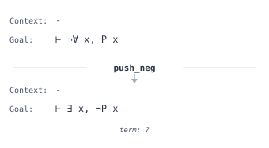
  <figcaption><em>The push Not tactic pushes negation inward through quantifiers.</em></figcaption>
</figure>

```lean
{{#include ../../src/ZeroToQED/Tactics.lean:push_neg}}
```

### `by_cases`

The `by_cases` tactic splits the proof into two cases based on whether a proposition is true or false, adding the proposition as a hypothesis in one branch and its negation in the other.

```lean
{{#include ../../src/ZeroToQED/Tactics.lean:by_cases}}
```

### choose

The `choose` tactic extracts a choice function from a hypothesis of the form `∀ x, ∃ y, P x y`. It produces a function `f` and a proof that `∀ x, P x (f x)`.

```lean
{{#include ../../src/ZeroToQED/Tactics.lean:choose}}
```

### lift

The `lift` tactic replaces a variable with one of a more specific type when you have a proof justifying the lift. For example, lifting an integer to a natural number given a proof it is nonnegative.

```lean
{{#include ../../src/ZeroToQED/Tactics.lean:lift}}
```

### zify

The `zify` tactic converts a goal about natural numbers to one about integers, which often makes subtraction and other operations easier to handle since integers are closed under subtraction.

```lean
{{#include ../../src/ZeroToQED/Tactics.lean:zify}}
```

### qify

The `qify` tactic converts a goal about integers or naturals to one about rationals, enabling division and making certain algebraic manipulations possible.

```lean
{{#include ../../src/ZeroToQED/Tactics.lean:qify}}
```

### rcases

The `rcases` tactic is `cases` with patterns. `⟨a, b⟩` destructures a structure or conjunction, `a | b` splits a sum or disjunction, `rfl` substitutes an equation, and `-` discards a component. Patterns nest, so one line can take apart a hypothesis that would otherwise need several `cases`. The `obtain` tactic uses the same pattern language.

```lean
{{#include ../../src/ZeroToQED/Tactics.lean:rcases}}
```

### match

The `match` tactic performs case analysis with the same syntax as a `match` expression in a definition. Each alternative becomes a goal with the pattern variables in context. It is often clearer than `cases` when the patterns are nested or when you want to name the cases by shape.

```lean
{{#include ../../src/ZeroToQED/Tactics.lean:match_tactic}}
```

### `fun_induction` and `fun_cases`

The `fun_induction f x` tactic performs induction following the recursive structure of the function `f` rather than the structure of its argument, producing one goal per equation of `f` with an induction hypothesis for each recursive call. The `fun_cases` tactic gives the same case split without the induction hypotheses. Both use the functional induction principle Lean generates for every recursive definition.

```lean
{{#include ../../src/ZeroToQED/Tactics.lean:fun_induction}}
```

### injection and injections

The `injection h` tactic uses the fact that constructors are injective: from `h : Nat.succ a = Nat.succ b` it derives `a = b`. The `injections` tactic applies `injection` to every hypothesis repeatedly, which unpacks nested constructor equalities such as `a :: b :: l = c :: d :: m`. Both close the goal outright when the constructors differ.

```lean
{{#include ../../src/ZeroToQED/Tactics.lean:injection}}
```

### if

The `if h : c then t else e` tactic splits the proof on a decidable condition, with `h : c` in one branch and `h : ¬c` in the other. It is `by_cases` with the branches written inline.

```lean
{{#include ../../src/ZeroToQED/Tactics.lean:if_tactic}}
```

### `false_or_by_contra`

The `false_or_by_contra` tactic changes the goal to `False` while keeping as much information as possible. It introduces the premise of an implication or negation, and for a plain proposition `P` it adds `¬P` to the context. It is the preprocessing step that `omega`, `grind` and `bv_decide` run before their own reasoning.

```lean
{{#include ../../src/ZeroToQED/Tactics.lean:false_or_by_contra}}
```

### classical

The `classical` tactic makes the axiom of choice available for the rest of the proof so that every proposition is decidable and `by_cases` works on any statement. It is a scoping tactic: the instance it adds exists only within the current proof.

```lean
{{#include ../../src/ZeroToQED/Tactics.lean:classical}}
```

## Searching

### assumption

The `assumption` tactic closes the goal if there is a hypothesis in the context that exactly matches. It searches through all available hypotheses to find one with the right type.

<figure style="text-align: center; margin: 1.5em 0;">
  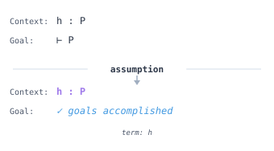
  <figcaption><em>The assumption tactic finds a matching hypothesis and closes the goal.</em></figcaption>
</figure>

```lean
{{#include ../../src/ZeroToQED/Tactics.lean:assumption}}
```

### trivial

The `trivial` tactic tries a collection of simple tactics including `rfl`, `assumption`, and `contradiction` to close easy goals without you specifying which approach to use.

```lean
{{#include ../../src/ZeroToQED/Tactics.lean:trivial}}
```

### decide

The `decide` tactic evaluates decidable propositions by computation. For finite checks like `2 < 5` or membership in a finite list, it simply computes the answer and closes the goal.

```lean
{{#include ../../src/ZeroToQED/Tactics.lean:decide}}
```

> [!NOTE]
> `decide` works in the kernel and produces small proof terms but can be slow. `native_decide` compiles the decision procedure to native code and runs it, which is much faster, but the kernel never sees the computation. Instead each call introduces a fresh axiom asserting the result, and `#print axioms` lists it by name (for example `big._native.native_decide.ax_1_1`). You are trusting the compiler and runtime for that one fact. For quick checks use `decide`; for expensive computations like verifying grid states in our Game of Life proofs, `native_decide` is essential.

### cbv

The `cbv` tactic reduces the goal by **call-by-value** evaluation: it unfolds definitions and evaluates arguments innermost-first, the same reduction strategy the compiler uses. It sits between `simp` and `decide`. Where `simp` rewrites with lemmas and `decide` demands a full `Decidable` instance, `cbv` just runs the computation. It accepts a location (`cbv at h`), a step limit (`set_option cbv.maxSteps n`), and short-circuits `Or` and `And`. Mark a definition `@[cbv_opaque]` to stop `cbv` from unfolding it, and tag an equation `@[cbv_eval]` to give `cbv` a rewrite rule to use in its place, which is how you keep an expensive or irrelevant definition folded while still computing around it. The companion `decide_cbv` finishes a decidable goal using the same evaluator, often succeeding where plain `decide` would be slow or stack-heavy.

```lean
{{#include ../../src/ZeroToQED/Tactics.lean:cbv}}
```

> [!NOTE]
> `cbv` supports a simproc system, location syntax, and step limits, and it can also be used inside grind's interactive `sym =>` mode. Reach for it when a goal is true purely by computation but stating the right `simp` set is awkward and `decide` is too blunt.

### hint

The `hint` tactic suggests which tactics might make progress on the current goal. It is a discovery tool that helps when you are unsure how to proceed.

```lean
{{#include ../../src/ZeroToQED/Tactics.lean:hint}}
```

### try? and autoTry

The `try?` tactic goes a step further than `hint`: it runs a battery of automation (`simp`, `grind`, `omega`, induction, and others) and, when something closes the goal, offers the resulting script as a "Try these" suggestion you can click to insert. Setting `set_option autoTry.onEmptyProof true` runs it automatically whenever you leave a `by` block empty, and `autoTry.onSorry` does the same for each `sorry`.

```lean
{{#include ../../src/ZeroToQED/Tactics.lean:try_question}}
```

### `exact?` and `apply?`

The `exact?` tactic searches the imported library for a lemma that closes the goal outright and reports it as a `Try this` suggestion. The `apply?` tactic does the same but accepts lemmas that leave side goals, and `rw?` looks for a rewrite that makes progress. All three are discovery tools, so once a suggestion appears, paste it in place of the search.

```lean
{{#include ../../src/ZeroToQED/Tactics.lean:exact_question}}
```

### `native_decide`, `decide +kernel` and `decide_cbv`

These are the alternative evaluation strategies behind `decide`. The `native_decide` tactic compiles the decision procedure and trusts the compiler, recorded as an extra axiom. The `decide +kernel` form skips the elaborator's reduction and hands the whole computation to the kernel, which is faster for big terms. The `decide_cbv` tactic uses the call-by-value evaluator of `cbv`. All three settle goals that plain `decide` finds too slow.

```lean
{{#include ../../src/ZeroToQED/Tactics.lean:native_decide}}
```

## General Automation

### omega

The **`omega`** tactic is a decision procedure for linear arithmetic over natural numbers and integers. It handles goals involving addition, subtraction, multiplication by constants, and comparisons.

```lean
{{#include ../../src/ZeroToQED/Tactics.lean:omega}}
```

> [!NOTE]
> `lia` is the newer alternative: the same class of linear integer goals, solved by `grind`'s arithmetic engine, and extensible with lemmas tagged `@[lia]` (which is why it understands `min` and `max` out of the box). Either works; `lia` is where development is happening.
>
> `omega` handles `Nat` and `Int` but not `Rat` or `Real`. It solves linear constraints but fails on nonlinear multiplication like `x * y < z`. For rationals, try `linarith` after `qify`. For nonlinear goals, try `nlinarith` or `polyrith`.

### linarith

The `linarith` tactic proves goals that follow from linear arithmetic over ordered rings. It searches for a nonnegative combination of the hypotheses that yields a contradiction (by default with a simplex-based oracle; Fourier-Motzkin elimination is available as an option) and then verifies that certificate inside Lean.

```lean
{{#include ../../src/ZeroToQED/Tactics.lean:linarith}}
```

### nlinarith

The `nlinarith` tactic extends `linarith` to handle some nonlinear goals by first preprocessing with polynomial arithmetic before applying linear reasoning.

```lean
{{#include ../../src/ZeroToQED/Tactics.lean:nlinarith}}
```

### smt

The **`smt`** tactic discharges goals to an external **SMT solver**, cvc5. SMT (Satisfiability Modulo Theories) solvers are battle-tested tools that combine SAT solving with decision procedures for arithmetic, arrays, bitvectors, and uninterpreted functions. When `omega` or `linarith` cannot handle your goal because it involves function symbols or complex quantifier patterns, an SMT solver often can.

The `smt` tactic translates your goal to SMT-LIB format, calls the solver, and if the solver returns "unsatisfiable" (meaning your goal is valid), it reconstructs a proof in Lean. This is not a trusted oracle; the proof is checked by Lean's kernel.

```lean
{{#include ../../examples/smt/SMTExamples.lean:smt_basic}}
```

SMT solvers excel at **uninterpreted functions**, reasoning about function applications without knowing what the functions compute:

```lean
{{#include ../../examples/smt/SMTExamples.lean:smt_uninterpreted}}
```

They handle **quantifiers** through instantiation heuristics, though this can be unpredictable:

```lean
{{#include ../../examples/smt/SMTExamples.lean:smt_quantifiers}}
```

The real power emerges when combining theories. Here the solver mixes arithmetic with uninterpreted functions:

```lean
{{#include ../../examples/smt/SMTExamples.lean:smt_combined}}
```

> [!NOTE]
> The `smt` tactic requires setup. Add the [lean-smt](https://github.com/ufmg-smite/lean-smt) library to your `lakefile.lean`:
>
> ```lean
> require smt from git "https://github.com/ufmg-smite/lean-smt.git" @ "main"
> ```
>
> Import with `import Smt`. lean-smt drives cvc5 and replays its proofs in Lean; check the repository for compatible Lean versions and how it obtains the solver. The examples in this section live under `examples/smt` and are not part of the book's build, because lean-smt tracks its own Lean release. The examples above are standalone and not part of this book's build; copy them to your own project to try them.

### ring

The **`ring`** tactic proves polynomial equalities in commutative rings by normalizing both sides to a canonical form and checking if they match. It handles addition, multiplication, and powers.

```lean
{{#include ../../src/ZeroToQED/Tactics.lean:ring}}
```

### `noncomm_ring`

The `noncomm_ring` tactic proves equalities in non-commutative rings where multiplication order matters, such as matrix rings or quaternions.

```lean
{{#include ../../src/ZeroToQED/Tactics.lean:noncomm_ring}}
```

### `field_simp`

The `field_simp` tactic clears denominators in field expressions by multiplying through, reducing goals involving fractions to polynomial equalities that `ring` can handle.

```lean
{{#include ../../src/ZeroToQED/Tactics.lean:field_simp}}
```

### abel

The `abel` tactic proves equalities in abelian groups by normalizing expressions involving addition, subtraction, and negation to a canonical form.

```lean
{{#include ../../src/ZeroToQED/Tactics.lean:abel}}
```

### group

The `group` tactic proves equalities in groups using the group axioms. It handles multiplication, inverses, and the identity element, normalizing expressions to compare them.

```lean
{{#include ../../src/ZeroToQED/Tactics.lean:group}}
```

### module

The `module` tactic proves equalities in modules over a ring, handling scalar multiplication and vector addition to normalize expressions.

```lean
{{#include ../../src/ZeroToQED/Tactics.lean:module_tactic}}
```

### aesop

The `aesop` tactic is a general-purpose automation tactic that combines many strategies including simplification, introduction rules, and case splitting to solve goals automatically.

```lean
{{#include ../../src/ZeroToQED/Tactics.lean:aesop}}
```

> [!TIP]
> `aesop` is powerful but can be slow on complex goals. Use `aesop?` to see what it did, then extract a faster proof. Register custom lemmas with `@[aesop safe]` or `@[aesop unsafe 50%]` to extend its knowledge. The `safe` rules are always applied; `unsafe` rules are tried with backtracking weighted by percentage.

### grind

The **`grind`** tactic is one of Lean 4's most sophisticated automation tools. Under the hood, it maintains an **e-graph** (equivalence graph), a data structure that efficiently represents equivalence classes of terms. When you assert `a = b`, the e-graph merges the equivalence classes containing `a` and `b`. The key insight is **congruence**: if `a = b`, then `f a = f b` for any function `f`. The e-graph propagates these consequences automatically.

The algorithm works in three phases. First, **congruence closure** processes all equalities and computes the transitive, symmetric, reflexive closure under function application. If you know $x = y$ and $f(x) = 10$, congruence closure deduces $f(y) = 10$ without explicit rewriting. Second, **forward chaining** applies implications: if you have $p \land q$ and $q \to r$, it extracts $q$ from the conjunction and fires the implication to derive $r$. Third, **case splitting** handles disjunctions and if-then-else expressions by exploring branches.

```lean
{{#include ../../src/ZeroToQED/Tactics.lean:grind}}
```

The power shows up when these mechanisms combine. Here `grind` chains four equalities through two functions to conclude `f b = 42`:

```lean
{{#include ../../src/ZeroToQED/Tactics.lean:grind_complex}}
```

> [!TIP]
> `grind` excels at "obvious" goals that would require tedious manual rewriting. If your goal involves chained equalities, function congruence, or propositional reasoning, try `grind` before writing out the steps by hand. For debugging, `grind?` reports which lemmas were actually used and suggests an equivalent `grind only [...]` call, which is faster and more robust to library changes.

When `grind` fails, or when you want to understand why it succeeds, the `sym =>` block exposes the same engine one step at a time. Unlike `grind`, it does not start by introducing hypotheses and negating the goal; you issue the steps yourself. `instantiate` runs one round of E-matching (here, firing `hinj` on the matching terms `f a` and `f b`), `show_eqcs` prints the current equivalence classes, and `finish` hands the remaining state to the full solver. Other decision procedures plug into the same state: `cbv` and `bv_decide` can both be called inside `sym =>`.

```lean
{{#include ../../src/ZeroToQED/Tactics.lean:grind_sym}}
```

### tauto

The `tauto` tactic proves propositional tautologies involving $\land$, $\lor$, $\to$, $\leftrightarrow$, $\lnot$, `True`, and `False`. It reasons classically; Mathlib's `itauto` is the intuitionistic counterpart.

```lean
{{#include ../../src/ZeroToQED/Tactics.lean:tauto}}
```

### lia

The `lia` tactic is `grind` with only its linear integer arithmetic solver enabled. It handles the same goals as `omega` by a different method and replaces the deprecated name `cutsat`. Use `grind` when you need more than arithmetic.

```lean
{{#include ../../src/ZeroToQED/Tactics.lean:lia}}
```

### grobner

The `grobner` tactic solves polynomial equalities over commutative rings from polynomial hypotheses using Gröbner bases. It is `grind` with only that solver enabled, and it closes goals that `ring` cannot because `ring` ignores hypotheses.

```lean
{{#include ../../src/ZeroToQED/Tactics.lean:grobner}}
```

### `grind_order` and `grind_linarith`

The `grind_order` tactic solves goals about partial and linear orders, and `grind_linarith` solves linear arithmetic over ordered fields. Each is `grind` restricted to a single solver, so they are faster and fail with a smaller trace when they do not apply.

```lean
{{#include ../../src/ZeroToQED/Tactics.lean:grind_wrappers}}
```

### `bv_decide`

The `bv_decide` tactic decides goals about fixed-width bit vectors and booleans by handing them to a SAT solver and then replaying the solver's certificate inside Lean, so the result is a real proof rather than a trusted call. The `bv_normalize` tactic runs only its preprocessing, which already closes many simple goals, and `bv_omega` translates bit vector arithmetic to natural numbers and calls `omega`. The `bv_check` tactic replays a certificate saved to a file, and `bv_decide?` suggests that form.

```lean
{{#include ../../src/ZeroToQED/Tactics.lean:bv_decide}}
```

### itauto

The `itauto` tactic is the intuitionistic sibling of `tauto`. It proves propositional goals without the law of excluded middle, which means goals like `¬¬p → p` are out of reach but everything it proves is constructively valid. It is a Mathlib tactic.

```lean
{{#include ../../src/ZeroToQED/Tactics.lean:itauto}}
```

## Goal Operations

### sorry

The `sorry` tactic closes any goal without actually proving it, leaving a hole in the proof. Use it as a placeholder during development, but never in finished proofs: a theorem that uses it rests on the `sorryAx` axiom, which can prove anything.

```lean
{{#include ../../src/ZeroToQED/Tactics.lean:sorry_admit}}
```

> [!WARNING]
> Any theorem containing `sorry` depends on the axiom `sorryAx`, and so does everything that depends on it. Use `#print axioms myTheorem` to see whether a theorem is sorry-free. Mathlib rejects all PRs containing sorry. During development, `sorry` is invaluable for sketching proofs top-down, but treat each one as a debt to be paid.

### swap

The `swap` tactic exchanges the first two goals in the goal list, letting you work on the second goal first when that is more convenient.

```lean
{{#include ../../src/ZeroToQED/Tactics.lean:swap}}
```

### `pick_goal`

The `pick_goal` tactic moves a specific numbered goal to the front of the goal list, allowing you to address goals in any order you choose.

```lean
{{#include ../../src/ZeroToQED/Tactics.lean:pick_goal}}
```

### `all_goals`

The `all_goals` tactic applies a given tactic to every goal in the current goal list, which is useful when multiple goals can be solved the same way.

```lean
{{#include ../../src/ZeroToQED/Tactics.lean:all_goals}}
```

### `any_goals`

The `any_goals` tactic applies a given tactic to each goal where it succeeds, skipping goals where it fails. It succeeds if it makes progress on at least one goal.

```lean
{{#include ../../src/ZeroToQED/Tactics.lean:any_goals}}
```

### focus

The `focus` tactic restricts attention to the first goal, hiding all other goals. This helps ensure you complete one goal before moving to the next.

```lean
{{#include ../../src/ZeroToQED/Tactics.lean:focus}}
```

### try

The `try` tactic attempts to apply a tactic and succeeds regardless of whether the inner tactic succeeds or fails. It is useful for optional simplification steps.

```lean
{{#include ../../src/ZeroToQED/Tactics.lean:try}}
```

### first

The `first` tactic tries a list of tactics in order and uses the first one that succeeds. It fails only if all tactics fail.

```lean
{{#include ../../src/ZeroToQED/Tactics.lean:first}}
```

### repeat

The `repeat` tactic applies a given tactic repeatedly until it fails to make progress. It is useful for exhaustively applying a simplification or introduction rule.

```lean
{{#include ../../src/ZeroToQED/Tactics.lean:repeat}}
```

### case, `case'`, next and the Focusing Dot

The `case tag => tac` tactic selects a goal by its tag, such as `left` or `inl`, and requires `tac` to close it. The `case'` form selects the goal without requiring it to be closed, and `next => tac` picks the first goal whatever its tag. The centered dot `·` focuses on the first goal, runs the block, and fails if the goal is still open, which is the structured style used throughout this book.

```lean
{{#include ../../src/ZeroToQED/Tactics.lean:case}}
```

### Tactic Combinators

The semicolon `;` sequences tactics, while `<;>` applies the second tactic to all goals created by the first. These combinators help write concise proof scripts.

```lean
{{#include ../../src/ZeroToQED/Tactics.lean:tactic_combinators}}
```

### done and skip

The `skip` tactic does nothing and is useful as a placeholder in combinators. The `done` tactic fails unless there are no goals left, which makes it a cheap assertion at the end of a block that is meant to be complete.

```lean
{{#include ../../src/ZeroToQED/Tactics.lean:done_skip}}
```

### `fail_if_success`

The `fail_if_success tac` tactic succeeds only when `tac` fails and leaves the goal unchanged. It is how test files and tactic authors check that a tactic correctly rejects a goal.

```lean
{{#include ../../src/ZeroToQED/Tactics.lean:fail_if_success}}
```

### stop and admit

The `stop` tactic replaces everything after it with `sorry`, so a half-written proof still elaborates while you work on an earlier part. The `admit` tactic is a synonym for `sorry`. Both produce the usual warning that the declaration uses `sorry`.

```lean
{{#include ../../src/ZeroToQED/Tactics.lean:stop_admit}}
```

### `guard_target`, `guard_hyp` and `guard_expr`

The guard tactics assert facts about the proof state and fail otherwise: `guard_target = t` checks the goal is syntactically `t`, `guard_hyp h : t` checks the type of a hypothesis, and `guard_expr a = b` checks two expressions are equal. They make proofs robust against library changes by failing loudly where a silent change would otherwise go unnoticed.

```lean
{{#include ../../src/ZeroToQED/Tactics.lean:guards}}
```

### trace and `trace_state`

The `trace "msg"` tactic prints a message to the info view and `trace_state` prints the current goals. They are the print statements of tactic debugging and have no effect on the proof.

```lean
{{#include ../../src/ZeroToQED/Tactics.lean:trace}}
```

### `show_term`

The `show_term tac` tactic runs `tac` and reports the proof term it constructed as a `Try this` suggestion. It is the quickest way to see what a tactic actually did, and to replace a slow tactic call with the direct term.

```lean
{{#include ../../src/ZeroToQED/Tactics.lean:show_term}}
```

### `rotate_left` and `rotate_right`

The `rotate_left n` and `rotate_right n` tactics cycle the goal list so a different goal comes first. They are the general form of `swap`, which is `rotate_left 1`.

```lean
{{#include ../../src/ZeroToQED/Tactics.lean:rotate}}
```

### iterate, `repeat'` and `repeat1'`

The `iterate n tac` tactic runs `tac` exactly `n` times. The `repeat' tac` tactic applies `tac` recursively to every goal it produces until it fails everywhere, where `repeat` only ever works on the first goal. The `repeat1' tac` tactic is the same but fails if `tac` never succeeds.

```lean
{{#include ../../src/ZeroToQED/Tactics.lean:iterate}}
```

### solve

The `solve | tac₁ | tac₂` tactic tries each alternative in turn and commits to the first one that closes the goal completely. Unlike `first`, an alternative that makes progress without finishing counts as a failure.

```lean
{{#include ../../src/ZeroToQED/Tactics.lean:solve}}
```

### `with_reducible` and `with_unfolding_all`

These tactics run their argument under a different transparency setting. The `with_reducible tac` form lets `tac` unfold only definitions marked `@[reducible]`, which makes `rfl` and `simp` faster and more predictable. The `with_unfolding_all tac` form unfolds everything that is not opaque, including irreducible definitions. The related `with_reducible_and_instances` also unfolds instances.

```lean
{{#include ../../src/ZeroToQED/Tactics.lean:transparency}}
```

### `set_option ... in`, `open ... in` and unhygienic

The `set_option opt val in tac` and `open Ns in tac` forms scope an option or namespace to a single tactic. The `unhygienic tac` form disables name hygiene for `tac`, so names it generates become accessible instead of being decorated with a dagger. It is the local equivalent of `set_option tactic.hygienic false`.

```lean
{{#include ../../src/ZeroToQED/Tactics.lean:scoped}}
```

### `as_aux_lemma` and `run_tac`

The `as_aux_lemma => tac` tactic stores the proof term that `tac` produces as a separate auxiliary lemma, which keeps a huge term out of the main declaration. The `run_tac` tactic executes arbitrary `TacticM` code inline and is the smallest possible way to write a custom tactic.

```lean
{{#include ../../src/ZeroToQED/Tactics.lean:aux_lemma}}
```

### impossible

The `impossible by tac` tactic uses `tac` to prove that the current goal has no proof: if the goal is `xs ⊢ P`, the inner tactic sees `¬ ∀ xs, P`. It then closes the goal with `sorry`, so the declaration still warns, but you have a checked record that the statement is wrong rather than merely hard.

```lean
{{#include ../../src/ZeroToQED/Tactics.lean:impossible}}
```

## Termination

Recursive definitions must be shown to terminate. When Lean cannot see a structurally decreasing argument it falls back to well-founded recursion and asks for a proof that the measure given by `termination_by` decreases at every recursive call. The tactics in this section are the ones that prove those goals; usually they run on your behalf and you only meet them when the default fails.

### `decreasing_tactic` and `decreasing_trivial`

The `decreasing_tactic` is the default proof Lean attempts for every termination goal. It cleans the goal up with `simp_wf`, then runs `decreasing_trivial`, an extensible tactic that tries `omega`, `simp` with arithmetic lemmas and the lexicographic order lemmas. You can extend it by adding `macro_rules` alternatives for `decreasing_trivial`, and Lean will try yours alongside the built-in ones. Writing `decreasing_by all_goals decreasing_tactic` is the same as leaving `decreasing_by` out, as the `ack` example shows.

### `decreasing_with`

The `decreasing_with tac` tactic performs the same cleanup as `decreasing_tactic` and then runs `tac` instead of `decreasing_trivial`. It is the right thing to put after `decreasing_by` when the default fails but a specific tactic such as `omega` or `simp_all` finishes the goal.

### `simp_wf`

The `simp_wf` tactic unfolds the well-founded relation machinery in a termination goal, turning `(a, b) ≺ (c, d)` style goals into readable statements about `<` on the components. It is the first step of `decreasing_tactic`; invoke it by hand when you want to see the goal before choosing a tactic.

```lean
{{#include ../../src/ZeroToQED/Tactics.lean:decreasing}}
```

### `get_elem_tactic`

The `get_elem_tactic` is the tactic Lean runs to discharge the bounds proof hidden inside array and list indexing `xs[i]`. It tries `omega`, `simp` and the hypotheses in context, and its `get_elem_tactic_trivial` extension point lets you add your own rules. If an indexing expression fails to elaborate because the bound is not obvious, this is the tactic that gave up, and the fix is to put the bound in the context or call it with an explicit proof `xs[i]'h`.

```lean
{{#include ../../src/ZeroToQED/Tactics.lean:get_elem_tactic}}
```

## Program Verification

Lean's standard library includes a program logic for `do` notation. A specification is a Hoare triple `⦃P⦄ prog ⦃⇓ r => Q r⦄` stating that if the precondition `P` holds before `prog` runs, the result `r` satisfies the postcondition `Q`. Assertions live in `SPred σs`, a logic of predicates over the state types of the monad in question, and `⌜p⌝` embeds an ordinary proposition. The tactics in this section generate verification conditions from a program and then prove them inside a stateful proof mode whose tactics mirror the familiar ones with an `m` prefix. The whole feature is marked experimental in Lean 4.34 and emits a warning when used; the examples wrap it in `#guard_msgs` to assert the exact warning.

### mvcgen

The `mvcgen` tactic takes a Hoare triple goal and breaks it into verification conditions, one for each point where the program's control flow needs a fact proved. It unfolds the definitions you list, applies registered `@[spec]` lemmas for library functions and for `pure`, `bind` and the rest of the monad, and leaves the remaining logical goals to you or to `all_goals grind`. Loops need an invariant, supplied with the `invariants` clause. In the `sumList` example the invariant relates the accumulator to the prefix of the list already processed, and `grind` closes the three resulting goals. The variant `mvcgen_trivial` runs the pass that discharges trivial conditions on its own. The `vcgen` tactic is a drop-in alternative with the same syntax, also experimental.

```lean
{{#include ../../src/ZeroToQED/Tactics.lean:mvcgen}}
```

### mspec

The `mspec` tactic is the `apply` of the program logic. Given a stateful goal whose target is the weakest precondition of a program, `mspec foo_spec` matches the specification against the program's first action and produces goals for its precondition and for the rest of the program. Called with no argument it looks up the specification registered for the action. The `mframe` tactic, which `mspec` uses internally, works out which stateful hypotheses are pure and moves them aside so they survive the step.

```lean
{{#include ../../src/ZeroToQED/Tactics.lean:mspec}}
```

### mintro, massumption and mexact

The `mintro` tactic enters the stateful proof mode and introduces hypotheses from an entailment `P ⊢ₛ Q → R`, naming them like `intro` does and accepting the same patterns as `rintro`. Writing `-` discards a hypothesis. The `mexact h` tactic closes the goal with a stateful hypothesis and `massumption` searches the stateful context for one. The `mstart` tactic enters the mode explicitly, which `mintro` otherwise does on its own.

```lean
{{#include ../../src/ZeroToQED/Tactics.lean:mintro}}
```

### mcases and mspecialize

The `mcases h with pat` tactic destructures a stateful hypothesis using `rcases` patterns, including `|` for disjunctions and `-` to drop a component. The `mspecialize h a` tactic applies a stateful implication to stateful arguments in place.

```lean
{{#include ../../src/ZeroToQED/Tactics.lean:mcases}}
```

### mconstructor, mrefine, mleft, mright, mexists and mexfalso

These are the introduction tactics of the stateful mode and behave exactly like their unprefixed counterparts. The `mconstructor` tactic splits a conjunction, `mrefine` builds the goal from a term with holes, `mleft` and `mright` choose a side of a disjunction, `mexists w` supplies a witness, and `mexfalso` changes the goal to `⌜False⌝`.

```lean
{{#include ../../src/ZeroToQED/Tactics.lean:mconstructor}}
```

### mhave and mreplace

The `mhave h : P := by tac` tactic proves a new stateful hypothesis in a nested stateful goal and adds it to the context. The `mreplace` tactic does the same but overwrites a hypothesis of the same name.

```lean
{{#include ../../src/ZeroToQED/Tactics.lean:mhave}}
```

### mclear, mdup, `mrename_i` and mrevert

These manage the stateful context: `mclear` drops a hypothesis, `mdup h => h'` duplicates one, `mrename_i` names an inaccessible one, and `mrevert` moves a hypothesis back into the goal as an implication.

```lean
{{#include ../../src/ZeroToQED/Tactics.lean:mcontext}}
```

### mpure, `mpure_intro` and `mspecialize_pure`

Hypotheses of the form `⌜p⌝` carry ordinary propositions. The `mpure h` tactic moves such a hypothesis out of the stateful context into the regular Lean context as `h : p`, and `mpure_intro` turns a goal `⌜p⌝` into the regular goal `p`, leaving proof mode. The `mspecialize_pure` tactic applies a lemma from the regular context to stateful hypotheses, bridging the two worlds in the other direction. The `mintro` pattern `⌜h⌝` purifies a hypothesis as it is introduced.

```lean
{{#include ../../src/ZeroToQED/Tactics.lean:mpure}}
```

### mleave and mstop

The `mleave` tactic exits the stateful proof mode and unfolds the `SPred` connectives into an ordinary Lean proposition quantified over the state, which is the form that `simp`, `omega` and `grind` can work with. It is usually what you want after `mvcgen`. The `mstop` tactic only exits the mode, forgetting the names of stateful hypotheses and leaving the entailment as it was.

```lean
{{#include ../../src/ZeroToQED/Tactics.lean:mleave}}
```

## Domain-Specific Tactics

### `interval_cases`

The `interval_cases` tactic performs case analysis when a variable is known to lie in a finite range. Given bounds on a natural number, it generates a case for each possible value.

```lean
{{#include ../../src/ZeroToQED/Tactics.lean:interval_cases}}
```

### `fin_cases`

The `fin_cases` tactic performs case analysis on elements of a finite type like `Fin n` or `Bool`, creating a subgoal for each possible value of the type.

```lean
{{#include ../../src/ZeroToQED/Tactics.lean:fin_cases}}
```

## Working with Quantifiers

### Existential Quantifiers

Existential statements claim that some witness exists satisfying a property. To prove one, use `use` to provide the witness. To use an existential hypothesis, use `obtain` to extract the witness and its property.

```lean
{{#include ../../src/ZeroToQED/Tactics.lean:exists}}
```

### Universal Quantifiers

Universal statements claim a property holds for all values. To prove one, use `intro` to introduce an arbitrary value. To use a universal hypothesis, use `specialize` or simply apply it to a specific value.

```lean
{{#include ../../src/ZeroToQED/Tactics.lean:forall}}
```

## Using This Reference

You do not need to memorize this article. Bookmark it. When you encounter a goal you cannot close, return here and ask: what shape is my goal? Implication, conjunction, existential, equality? Find the matching section. The tactic you need is there. Over time, the common ones become muscle memory. The obscure ones remain here for when you need them.
